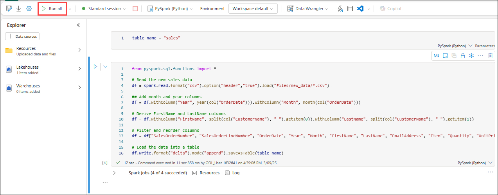
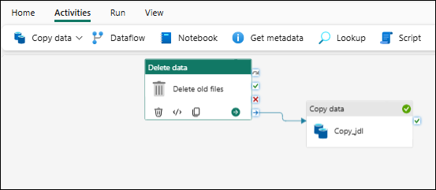
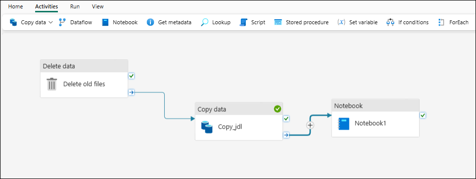
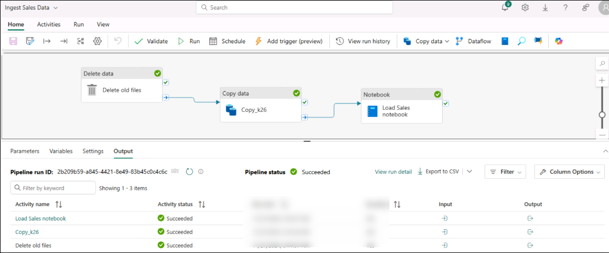

# Lab 2: Ingest data with a pipeline in Microsoft Fabric

## Estimated duration: 75 minutes

In this lab, you will learn how to ingest data into a Microsoft Fabric lakehouse using pipelines—an essential skill for building cloud-scale analytics solutions. A data lakehouse is a common analytical data store, and one of the core responsibilities of a data engineer is to manage the ingestion of data from multiple operational sources into this environment. You will implement *extract, transform, and load* (ETL) or *extract, load, and transform* (ELT) solutions by creating pipelines in Fabric.

Microsoft Fabric also supports Apache Spark, enabling scalable data processing. By combining pipeline and Spark capabilities, you will design a workflow that copies data from external sources into OneLake storage and uses Spark code to transform the data before loading it into tables for analysis.

## Lab Objectives

In this lab, you will be able to complete the following tasks:

- Task 1: Create a Subfolder in lakehouse
- Task 2: Create a pipeline
- Task 3: Create a notebook
- Task 4: Modify the pipeline


### Task 1: Create a Subfolder in lakehouse

In this task, you will create subfolder in the existing lakehouse.

1. On the menu bar on the left, select the **Lakehouse** created earlier.

1. On the **Explorer** pane on the left, in the **... (1)** menu for the **Files** node, select **New subfolder (2)** and create a subfolder named **new_data (3)**.

   

   

### Task 2: Create a pipeline

In this task, you will create a pipeline in Microsoft Fabric to ingest data into your lakehouse. You will use the Copy Data activity to extract data from a source and copy it into a subfolder within the lakehouse, forming the foundation for an ETL or ELT process.

1. On the **Home** page for your lakehouse, select **Get data (1)** and then select **New data pipeline (2)**, and create a new data pipeline named **Ingest Sales Data (3)**.

   

   

2. If the **Copy Data** wizard doesn't open automatically, select **Copy Data > Use copy assistant** in the pipeline editor page.

3. In the **Copy Data** wizard, on the **Choose data source** page, enter **HTTP (1)** in the search bar and then select **HTTP (2)** in the **New sources** section.

    

4. In the **Connect to data source** pane, enter the following settings for the connection to your data source:
    - **URL**: `https://raw.githubusercontent.com/MicrosoftLearning/dp-data/main/sales.csv`
    - **Connection**: Create new connection
    - **Connection name**: *Specify a unique name*
    - **Data gateway**: (none)
    - **Authentication kind**: Anonymous
5. Select **Next**. Then ensure the following settings are selected:
    - **Relative URL**: *Leave blank*
    - **Request method**: GET
    - **Additional headers**: *Leave blank*
    - **Binary copy**: <u>Un</u>selected
    - **Request timeout**: *Leave blank*
    - **Max concurrent connections**: *Leave blank*
6. Select **Next**, and wait for the data to be sampled and then ensure that the following settings are selected:
    - **File format**: DelimitedText
    - **Column delimiter**: Comma (,)
    - **Row delimiter**: Line feed (\n)
    - **First row as header**: Selected
    - **Compression type**: None
7. Select **Preview data** to see a sample of the data that will be ingested. Then close the data preview and select **Next**.
8. On the **Connect to data destination** page, set the following data destination options, and then select **Next**:
    - **Root folder**: Files
    - **Folder path name**: new_data
    - **File name**: sales.csv
    - **Copy behavior**: None
10. Set the following file format options and then select **Next**:
    - **File format**: DelimitedText
    - **Column delimiter**: Comma (,)
    - **Row delimiter**: Line feed (\n)
    - **Add header to file**: Selected
    - **Compression type**: None
11. On the **Copy summary** page, review the details of your copy operation and then select **Save + Run**.

12. A new pipeline containing a **Copy Data** activity is created, as shown here:

    

13. When the pipeline starts to run, you can monitor its status in the **Output** pane under the pipeline designer. Use the **&#8635;** (*Refresh*) icon to refresh the status, and wait until it has succeeeded.

14. In the menu bar on the left, select your lakehouse.

15. On the **Home** page, in the **Lakehouse explorer** pane, expand **Files** and select the **new_data (1)** folder to verify that the **sales.csv (2)** file has been copied.

    

### Task 3: Create a notebook

In this task, you will create a notebook in Microsoft Fabric to begin processing your ingested data using PySpark. You’ll write code to load sales data, apply transformations, and save the results as a table in the lakehouse—enabling further analysis or reporting through SQL or visualization tools.

1. On the **Home** page for your lakehouse, in the **Open notebook** menu, select **New notebook**.

    After a few seconds, a new notebook containing a single *cell* will open. Notebooks are made up of one or more cells that can contain *code* or *markdown* (formatted text).

2. Select the existing cell in the notebook, which contains some simple code, and then replace the default code with the following variable declaration.

    ```python
   table_name = "sales"
    ```

3. In the **...** menu for the cell (at its top-right) select **Toggle parameter cell**. This configures the cell so that the variables declared in it are treated as parameters when running the notebook from a pipeline.

4. Under the parameters cell, use the **+ Code** button to add a new code cell. Then add the following code to it:

    ```python
   from pyspark.sql.functions import *

   # Read the new sales data
   df = spark.read.format("csv").option("header","true").load("Files/new_data/*.csv")

   ## Add month and year columns
   df = df.withColumn("Year", year(col("OrderDate"))).withColumn("Month", month(col("OrderDate")))

   # Derive FirstName and LastName columns
   df = df.withColumn("FirstName", split(col("CustomerName"), " ").getItem(0)).withColumn("LastName", split(col("CustomerName"), " ").getItem(1))

   # Filter and reorder columns
   df = df["SalesOrderNumber", "SalesOrderLineNumber", "OrderDate", "Year", "Month", "FirstName", "LastName", "EmailAddress", "Item", "Quantity", "UnitPrice", "TaxAmount"]

   # Load the data into a table
   df.write.format("delta").mode("append").saveAsTable(table_name)
    ```

    This code loads the data from the sales.csv file that was ingested by the **Copy Data** activity, applies some transformation logic, and saves the transformed data as a table - appending the data if the table already exists.

5. Verify that your notebooks looks similar to this, and then use the **&#9655; Run all** button on the toolbar to run all of the cells it contains.

    

    > **Note**: Since this is the first time you've run any Spark code in this session, the Spark pool must be started. This means that the first cell can take a minute or so to complete.

6. When the notebook run has completed, in the **Lakehouse explorer** pane on the left, in the **...** menu for **Tables** select **Refresh** and verify that a **sales** table has been created.
7. In the notebook menu bar, use the ⚙️ **Settings** icon to view the notebook settings. Then set the **Name** of the notebook to **Load Sales** and close the settings pane.
8. In the hub menu bar on the left, select your lakehouse.
9. In the **Explorer** pane, refresh the view. Then expand **Tables**, and select the **sales** table to see a preview of the data it contains.

### Task 4: Modify the pipeline

In this task, you will modify your existing pipeline to include the notebook you created for data transformation. By integrating the notebook into the pipeline, you’ll build a reusable and automated ETL process that extracts data, runs Spark-based transformations, and loads the results into a lakehouse table.

1. In the hub menu bar on the left select the **Ingest Sales Data** pipeline you created previously.

2. On the **Activities (1)** tab, in the **All activities (2)** list, select **Delete data (3)**. Then position the new **Delete data**  activity to the left of the **Copy data** activity and connect its **On completion** output to the **Copy data** activity, as shown here:

    

    

3. Select the **Delete data** activity, and in the pane below the design canvas, set the following properties:
    - **General**:
        - **Name**: Delete old files
    - **Source**
        - **Connection**: *Your lakehouse*
        - **File path type**: Wildcard file path
        - **Folder path**: Files / **new_data**
        - **Wildcard file name**: *.csv        
        - **Recursively**: *Selected*
    - **Logging settings**:
        - **Enable logging**: *<u>Un</u>selected*

    These settings will ensure that any existing .csv files are deleted before copying the **sales.csv** file.

4. In the pipeline designer, on the **Activities** tab, select **Notebook** to add a **Notebook** activity to the pipeline.

5. Select the **Copy data** activity and then connect its **On Completion** output to the **Notebook** activity as shown here:

    

6. Select the **Notebook** activity, and then in the pane below the design canvas, set the following properties:
    - **General**:
        - **Name**: Load Sales notebook
    - **Settings**:
        - **Notebook**: Load Sales
        - **Base parameters**: *Add a new parameter with the following properties:*
            
            | Name | Type | Value |
            | -- | -- | -- |
            | table_name | String | new_sales |

    The **table_name** parameter will be passed to the notebook and override the default value assigned to the **table_name** variable in the parameters cell.

7. On the **Home** tab, use the **&#128427;** (*Save*) icon to save the pipeline. Then use the **&#9655; Run** button to run the pipeline, and wait for all of the activities to complete.

    

> Note: In case you receive the error message *Spark SQL queries are only possible in the context of a lakehouse. Please attach a lakehouse to proceed*: Open your notebook, select the lakehouse you created on the left pane, select **Remove all Lakehouses** and then add it again. Go back to the pipeline designer and select **&#9655; Run**.

8. In the hub menu bar on the left edge of the portal, select your lakehouse.

9. In the **Explorer** pane, expand **Tables** and select the **new_sales** table to see a preview of the data it contains. This table was created by the notebook when it was run by the pipeline.

    

### Review    

In this lab, you implemented a data ingestion solution that uses a pipeline to copy data to your lakehouse from an external source, and then uses a Spark notebook to transform the data and load it into a table.

In this lab, you have completed the following tasks:

- Created a Subfolder in lakehouse
- Created a pipeline
- Created a notebook
- Modified the pipeline

## Now, click on Next from the lower right corner to move on to the next lab.
