# Lab 01:  Analyze data in a data warehouse

### Estimated duration: 45 Minutes

In Microsoft Fabric, a data warehouse provides a relational database for large-scale analytics. Unlike the default read-only SQL endpoint for tables defined in a lakehouse, a data warehouse provides full SQL semantics, including the ability to insert, update, and delete data in the tables.

In this hands-on lab, you will learn how to create a data warehouse in Microsoft Fabric, define tables, build a relational data model, query data, and visualize results through reports. You will experience how a fully functional data warehouse enables large-scale analytics by offering full SQL semantics for inserting, updating, and deleting data.

## Lab Objectives

In this lab, you will complete the following tasks:

- Task 1: Create a data warehouse
- Task 2: Create tables and insert data
- Task 3: Query data warehouse tables
- Task 4: Create a view
- Task 5: Create a visual query
- Task 6: Define a data model

## Task 1: Create a data warehouse

In this task, you will create a new data warehouse in your Microsoft Fabric workspace. This will serve as the foundation for your analytics solution.

1. On the menu bar on the left, click on **(...) (1)** and then select **Create (1)**. In the *New* page, under the *Data Warehouse* section, select **Warehouse (3)**.

   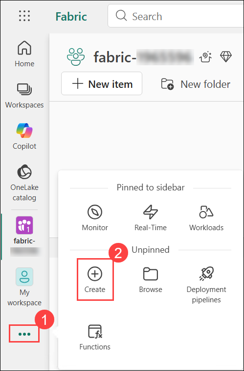

   .png)    

1. Enter **Warehouse1 (1)** as the name, and then click **Create (2)**.

   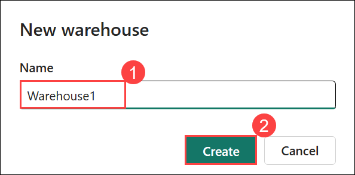

1. After a minute or so, a new warehouse will be created:

## Task 2: Create tables and insert data

In this task, you will create tables inside your data warehouse and populate them with sample data.

1. In your new warehouse, select the **T-SQL** tile.

   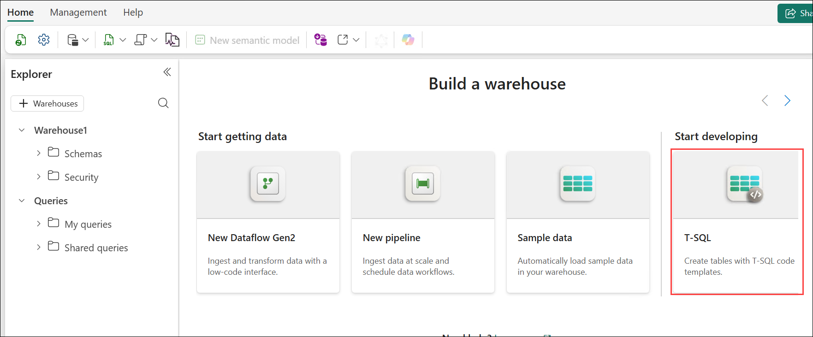

1. Use the following CREATE TABLE statement:

    ```sql
   CREATE TABLE dbo.DimProduct
   (
       ProductKey INTEGER NOT NULL,
       ProductAltKey VARCHAR(25) NULL,
       ProductName VARCHAR(50) NOT NULL,
       Category VARCHAR(50) NULL,
       ListPrice DECIMAL(5,2) NULL
   );
   GO
    ```

1. Use the **&#9655; Run** button to run the SQL script, which creates a new table named **DimProduct** in the **dbo** schema of the data warehouse.

   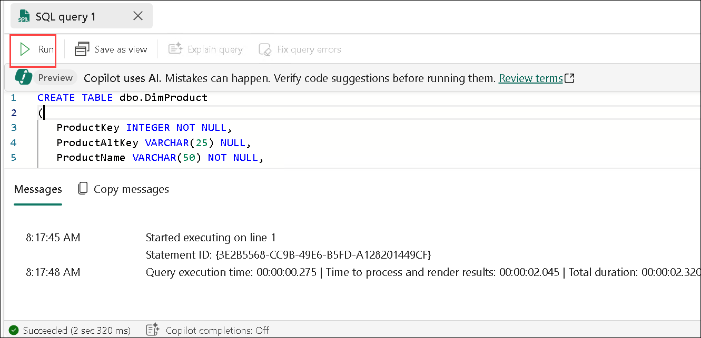

1. Use the **Refresh** button on the toolbar to refresh the view. Then, in the **Explorer** pane, expand **Schemas** > **dbo** > **Tables** and verify that the                **DimProduct** table has been created.

   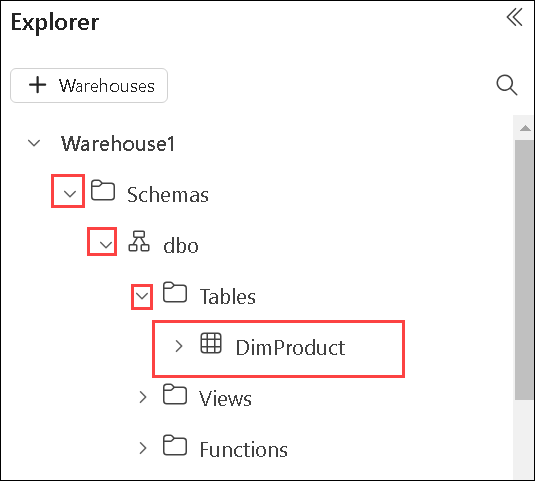

1. On the **Home** menu tab, click on **New SQL Query (1)** drop down and then select **New SQL Query (2)** to create a new query.

   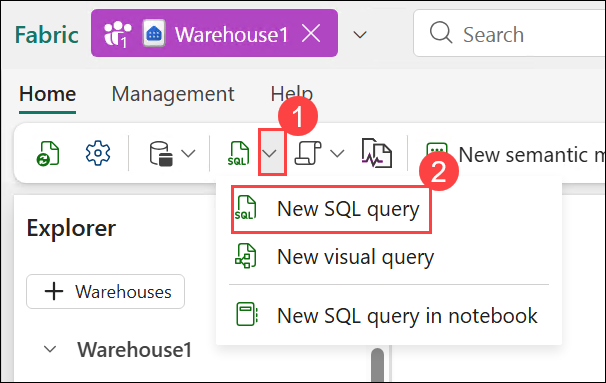

1. Enter the following INSERT statement:

    ```sql
   INSERT INTO dbo.DimProduct
   VALUES
   (1, 'RING1', 'Bicycle bell', 'Accessories', 5.99),
   (2, 'BRITE1', 'Front light', 'Accessories', 15.49),
   (3, 'BRITE2', 'Rear light', 'Accessories', 15.49);
   GO
    ```

1. Run the new query to insert three rows into the **DimProduct** table.

1. When the query has finished, in the **Explorer** pane, select the **DimProduct** table and verify that the three rows have been added to the table.

   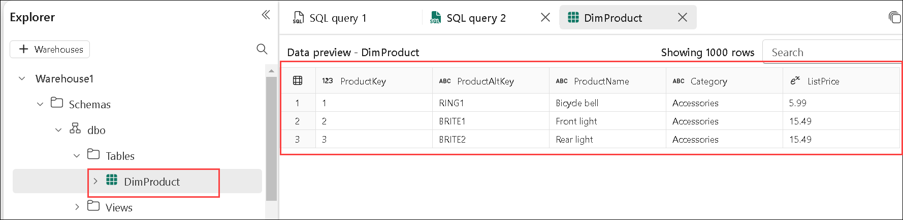

1. On the **Home** menu tab, use the **New SQL Query** button to create a new query.
1. In the Edge browser on the lab VM, copy and paste this URL into the address bar:
  `https://raw.githubusercontent.com/MicrosoftLearning/dp-data/main/create-dw.txt` into the new query pane.
1. Select all the text from the file (Ctrl+A, then Ctrl+C).

1. Go back to the SQL query window and paste the copied text (Ctrl+V) 

1. Run the query, which creates a simple data warehouse schema and loads some data. The script should take around 30 seconds to run.

1. Use the **Refresh** button on the toolbar to refresh the view. Then in the **Explorer** pane, verify that the **dbo** schema in the data warehouse now contains the following four tables:
    - **DimCustomer**
    - **DimDate**
    - **DimProduct**
    - **FactSalesOrder**

      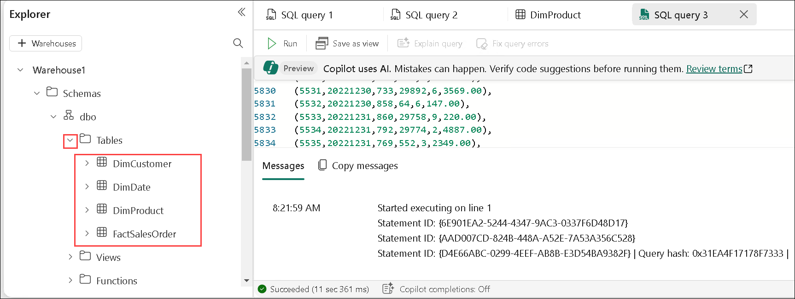    

      > **Tip**: If the schema takes a while to load, just refresh the browser page.

## Task 3: Query data warehouse tables

In this task, you will write and execute SQL queries to retrieve and aggregate data from the data warehouse.

### Query fact and dimension tables

Most queries in a relational data warehouse involve aggregating and grouping data (using aggregate functions and GROUP BY clauses) across related tables (using JOIN clauses).

1. Create a **New SQL Query**, and run the following code:

    ```sql
   SELECT  d.[Year] AS CalendarYear,
            d.[Month] AS MonthOfYear,
            d.MonthName AS MonthName,
           SUM(so.SalesTotal) AS SalesRevenue
   FROM FactSalesOrder AS so
   JOIN DimDate AS d ON so.SalesOrderDateKey = d.DateKey
   GROUP BY d.[Year], d.[Month], d.MonthName
   ORDER BY CalendarYear, MonthOfYear;
    ```

    Note that the attributes in the date dimension enable you to aggregate the measures in the fact table at multiple hierarchical levels - in this case, year and month. This is a common pattern in data warehouses.

2. Modify the query as follows to add a second dimension to the aggregation.

    ```sql
   SELECT  d.[Year] AS CalendarYear,
           d.[Month] AS MonthOfYear,
           d.MonthName AS MonthName,
           c.CountryRegion AS SalesRegion,
          SUM(so.SalesTotal) AS SalesRevenue
   FROM FactSalesOrder AS so
   JOIN DimDate AS d ON so.SalesOrderDateKey = d.DateKey
   JOIN DimCustomer AS c ON so.CustomerKey = c.CustomerKey
   GROUP BY d.[Year], d.[Month], d.MonthName, c.CountryRegion
   ORDER BY CalendarYear, MonthOfYear, SalesRegion;
    ```

3. Run the modified query and review the results, which now include **sales revenue** aggregated by year, month, and sales region.

   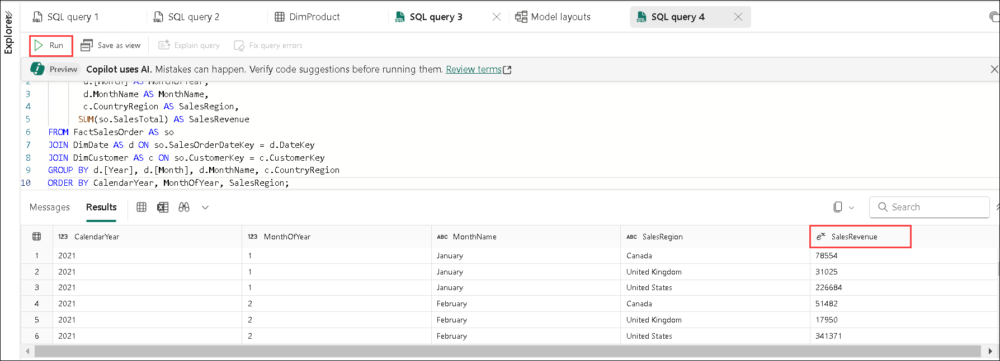

## Task 4: Create a view

A data warehouse in Microsoft Fabric has many of the same capabilities you may be used to in relational databases. For example, you can create database objects like *views* and *stored procedures* to encapsulate SQL logic.

In this task, you will encapsulate your SQL logic into a view, simplifying future querying.

1. Modify the query you created previously as follows to create a view (note that you need to remove the ORDER BY clause to create a view).

    ```sql
   CREATE VIEW vSalesByRegion
   AS
   SELECT  d.[Year] AS CalendarYear,
           d.[Month] AS MonthOfYear,
           d.MonthName AS MonthName,
           c.CountryRegion AS SalesRegion,
          SUM(so.SalesTotal) AS SalesRevenue
   FROM FactSalesOrder AS so
   JOIN DimDate AS d ON so.SalesOrderDateKey = d.DateKey
   JOIN DimCustomer AS c ON so.CustomerKey = c.CustomerKey
   GROUP BY d.[Year], d.[Month], d.MonthName, c.CountryRegion;
    ```

2. Run the query to create the view. Then refresh the data warehouse schema and verify that the new view is listed in the **Explorer** pane.

3. Create a new SQL query and run the following SELECT statement:

    ```SQL
   SELECT CalendarYear, MonthName, SalesRegion, SalesRevenue
   FROM vSalesByRegion
   ORDER BY CalendarYear, MonthOfYear, SalesRegion;
    ```

    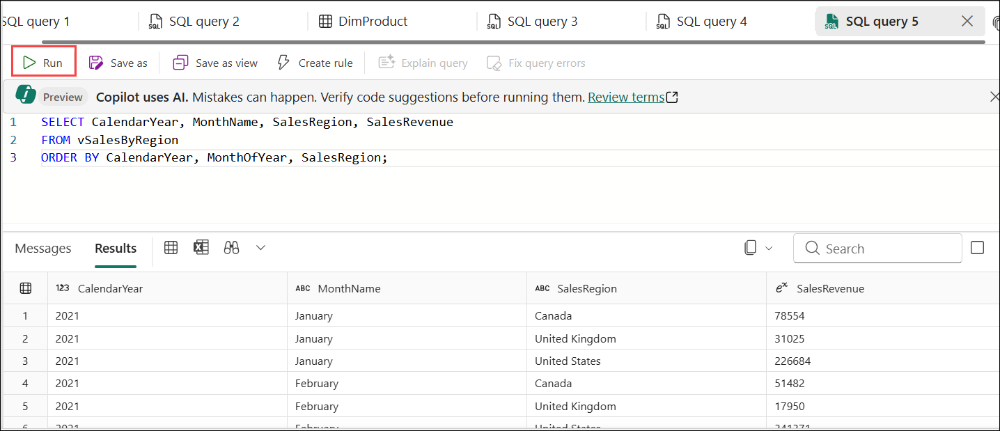    

## Task 5: Create a visual query

Instead of writing SQL code, you can use the graphical query designer to query the tables in your data warehouse. This experience is similar to Power Query online, where you can create data transformation steps with no code. For more complex tasks, you can use Power Query's M (Mashup) language.

In this task, you will use the visual query designer to build queries graphically, without writing SQL code.

1. On the **Home** menu, expand the options under **New SQL query (1)** and select **New visual query (2)**.

   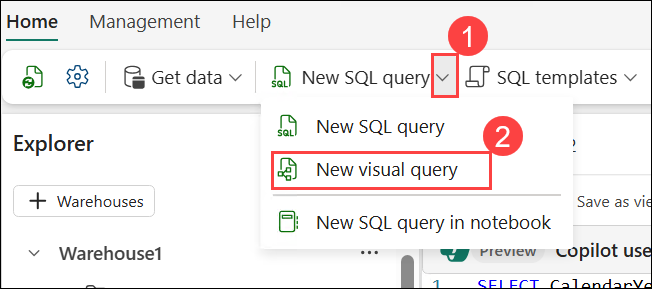

1. Drag **FactSalesOrder** onto the **canvas**. Notice that a preview of the table is displayed in the **Preview** pane below.

   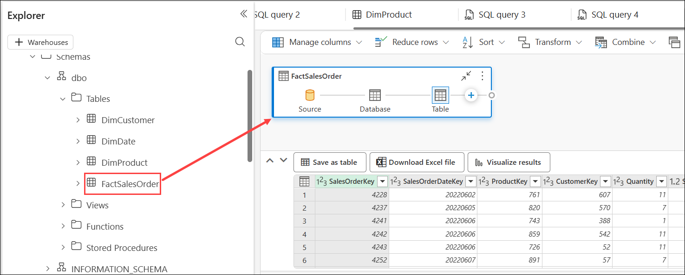

1. Drag **DimProduct** onto the **canvas**. We now have two tables in our query.

   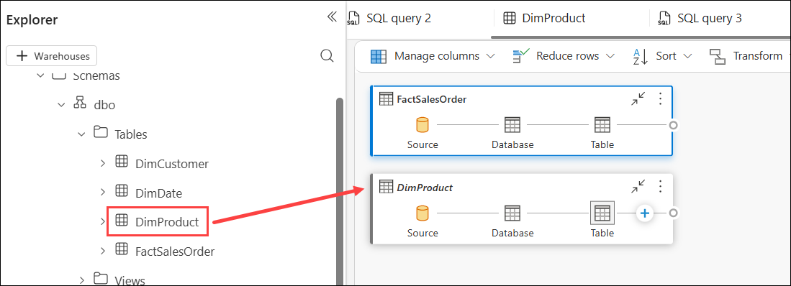

1. Use the **(+) (1)** button on the **FactSalesOrder** table on the canvas to **Merge queries (2)**.

   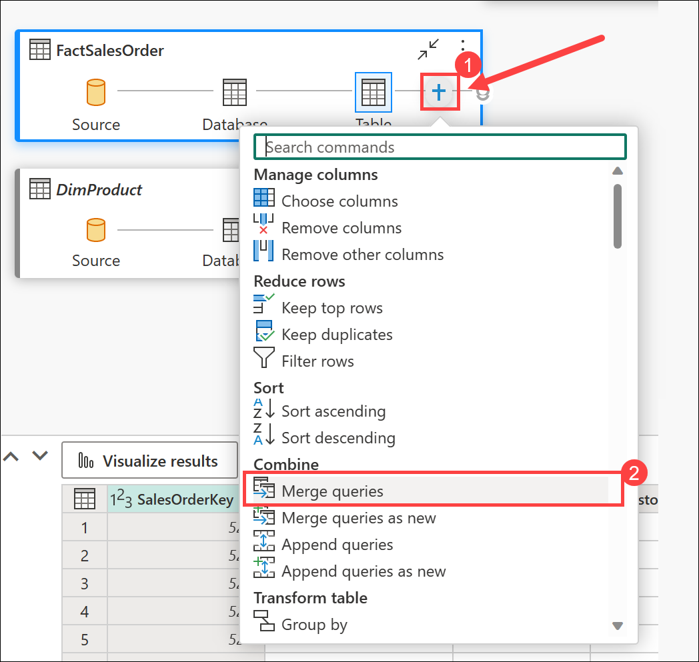

1. In the **Merge queries** window, select **DimProduct** as the right table for merge. Select **ProductKey** in both queries, leave the default **Left outer** join type,     and click **OK**.

1. In the **Preview**, note that the new **DimProduct** column has been added to the FactSalesOrder table. Expand the column by clicking the arrow to the right of the         column name  **(1)**. Select **ProductName (2)** and click **OK (3)**.

   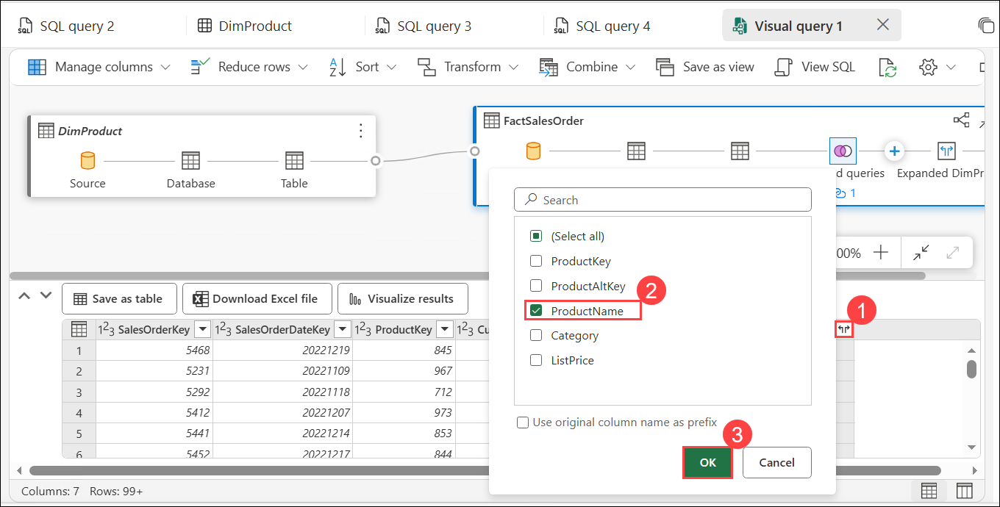

1. If you're interested in looking at data for a single product, per a manager's request, you can now use the **ProductName** column to filter the data in the query. Filter the **ProductName** column to look at **Cable Lock** data only.

1. From here, you can analyze the results of this single query by selecting **Visualize results** or **Download Excel file**. You can now see exactly what the manager was     asking for, so we don't need to analyze the results further.

   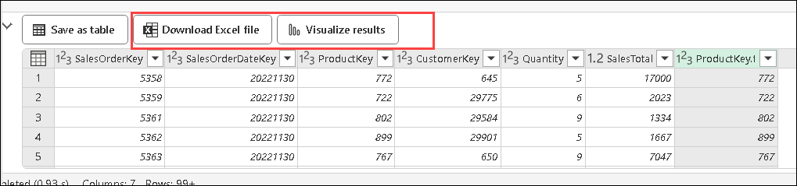


## Task 6: Define a data model

In this task, you will create a semantic model by organizing your fact and dimension tables and defining the relationships between them. This enables a structured data model that supports accurate analysis and reporting.

1. In the toolbar, select **New semantic model**.

   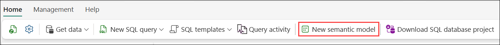

1. In the **New semantic model** window, name the semantic model as **Warehouse1 (1)** and select all four tables **(2)**:

   - DimCustomer
   - DimDate
   - Dimproduct
   - FactSalesOrder 
   - Select **Confirm (3)**.

      .png)

1. From the left navigation menu, select your workspace **(1)** and then click on newly created Semantic model **Warehosue1 (2)**.

   .png)

1. From the tool bar, click on **Open**.

   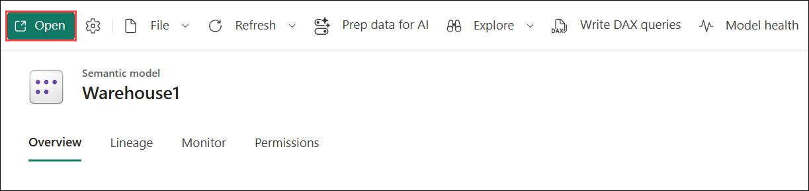

1. From the top right corner, click on **Viewing (1)** drop-down and select **Editing (2)**.

   .png)

1. In the model pane, rearrange the tables in your data warehouse so that the **FactSalesOrder** table is in the middle, like this:

   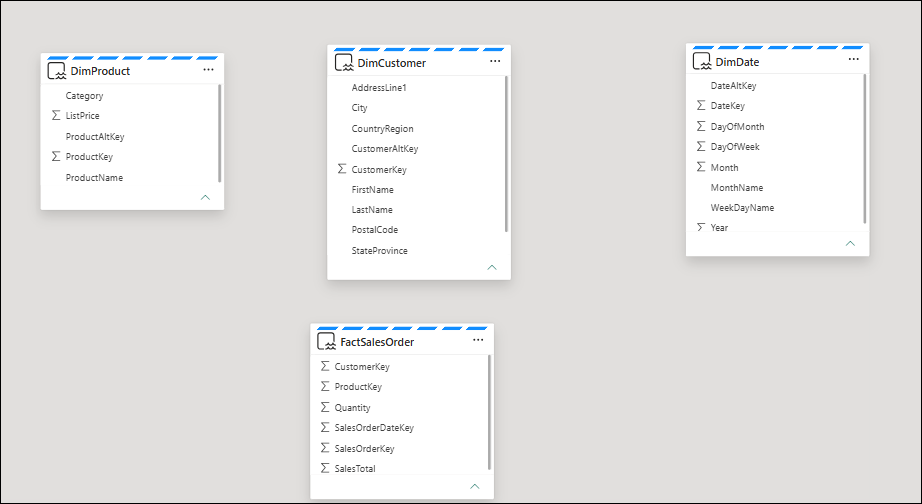

1. Drag the **ProductKey** field from the **FactSalesOrder** table and drop it on the **ProductKey** field in the **DimProduct** table. Then confirm the following relationship details:

    - **From table**: FactSalesOrder **(1)**
    - **Column**: ProductKey **(2)**
    - **To table**: DimProduct **(3)**
    - **Column**: ProductKey **(4)**
    - **Cardinality**: Many to one (*:1) **(5)**
    - **Cross filter direction**: Single **(6)**
    - **Make this relationship active**: Selected **(7)**
    - **Assume referential integrity**: Unselected **(8)**
    - Click **Save (9)**

      .png)

1. Repeat the process to create many-to-one relationships between the following tables:
    - **FactSalesOrder.CustomerKey** &#8594; **DimCustomer.CustomerKey**
    - **FactSalesOrder.SalesOrderDateKey** &#8594; **DimDate.DateKey**

    When all of the relationships have been defined, the model should look like this:

    .png)

## Review    

In this lab, you learned how to:

- Created and configure a Microsoft Fabric data warehouse.
- Defined relational tables and load data using SQL.
- Queried and aggregated data using SQL and visual interfaces.
- Created views to encapsulate queries.
- Defined a Data model

### Now, click on Next from the lower right corner to move on to the next lab.

