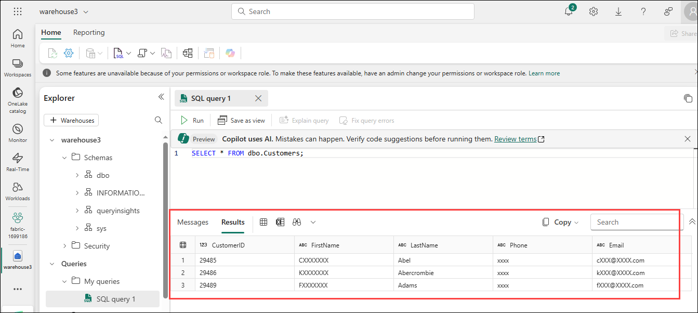
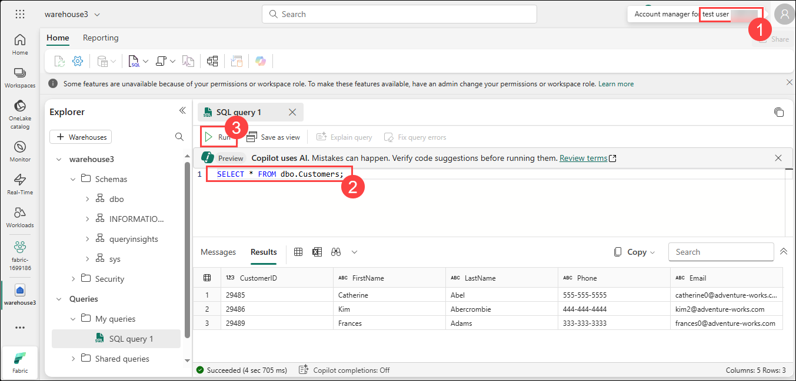
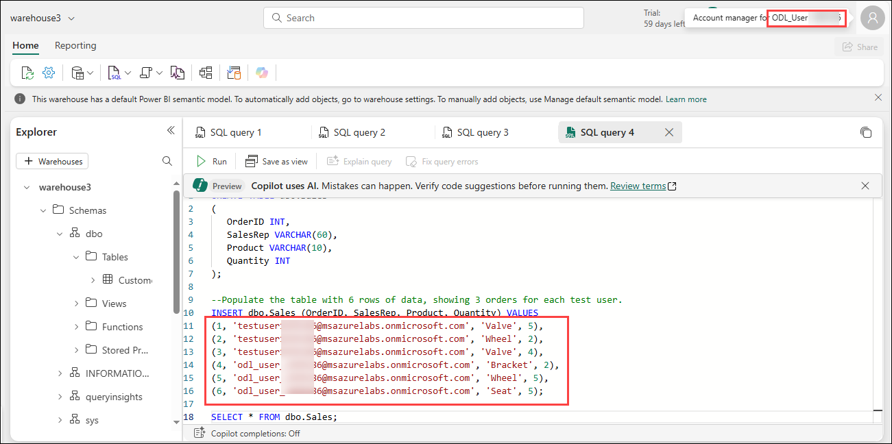

# Lab 5: Secure a Microsoft Fabric data warehouse

## Estimated duration : 60 minutes

Microsoft Fabric permissions and granular SQL permissions work together to govern Warehouse access and user permissions. In this exercise, you'll secure data using granular permissions, column-level security, row-level security, and dynamic data masking.

In this hands-on lab, you will learn how to implement comprehensive security strategies in a Microsoft Fabric data warehouse. You'll configure dynamic data masking, row-level security, and column-level security to protect sensitive information. You will also practice applying granular SQL permissions to control access at the object level, ensuring that users have the appropriate level of access to the data they need.

## Lab Objectives

In this lab, you will complete the following tasks:

- Task 1: Add a user to the workspace Viewer role

- Task 2: Apply dynamic data masking rules to columns in a table

- Task 3: Apply row-level security

- Task 4: Implement column-level security

- Task 5: Configure SQL granular permissions using T-SQL

### Task 1: Add a User to the Workspace Viewer Role in Fabric

In this task, you will add a user to the Viewer role within a Microsoft Fabric workspace. Assigning workspace roles ensures that users have appropriate permissions before you apply further database-level security. Viewers can explore data but cannot modify content, providing a foundation for later security configurations.

1. Open the **fabric-<inject key="DeploymentID" enableCopy="false"/>** workspace you just created.

1. From the top menu, select **Manage Access**.

1. Click on Add people or groups.

1. Enter the name or email address of the second user you want to add from your environment.

   - Email : <inject key="testuser" enableCopy="true"/>

1. In the role selection dropdown, choose **Viewer**.

1. Click **Add** to confirm the user assignment.

> **Note**: When you create a workspace, you automatically become a member of the Workspace Admin role. 

### Task 2: Apply dynamic data masking rules to columns in a table

Dynamic data masking rules are applied on individual columns at the table level so all queries are affected by the masking. Users who do not have explicit permissions to view confidential data see masked values in query results while users with explicit permission to view the data see it unobscured. There are four types of masks: default, email, random and custom string. In this exercise, you will apply a default mask, an email mask, and a custom string mask.

In this task, you will configure dynamic data masking on specific table columns in your data warehouse. Dynamic data masking helps protect sensitive information by obscuring it at query time, ensuring that users can access necessary data without exposing confidential details such as email addresses or credit card numbers.

1. In the left-hand menu, select **Create**. On the New page, under the Data Warehouse section, choose **Warehouse**. Enter **Warehouse3** as the name, and then click **Create**.

   >**Note**: If the **Create** option is not pinned to the sidebar, you need to select the ellipsis (**...**) option first.

1. After a minute or so, a new warehouse will be created:

1. In your warehouse, select the **T-SQL** tile, and use the following T-SQL statements to create a table and to insert and view data.  

    ```T-SQL
   CREATE TABLE dbo.Customers
   (   
       CustomerID INT NOT NULL,   
       FirstName varchar(50) MASKED WITH (FUNCTION = 'partial(1,"XXXXXXX",0)') NULL,     
       LastName varchar(50) NOT NULL,     
       Phone varchar(20) MASKED WITH (FUNCTION = 'default()') NULL,     
       Email varchar(50) MASKED WITH (FUNCTION = 'email()') NULL   
   );
   
   INSERT dbo.Customers (CustomerID, FirstName, LastName, Phone, Email) VALUES
   (29485,'Catherine','Abel','555-555-5555','catherine0@adventure-works.com'),
   (29486,'Kim','Abercrombie','444-444-4444','kim2@adventure-works.com'),
   (29489,'Frances','Adams','333-333-3333','frances0@adventure-works.com');
   
   SELECT * FROM dbo.Customers;
    ```

    When users who are restricted from seeing unmasked data query the table, the **FirstName** column will show the first letter of the string with XXXXXXX and none of the last characters. The **Phone** column will show xxxx. The **Email** column will show the first letter of the email address followed by `XXX@XXX.com`. This approach ensures that sensitive data remains confidential, while still allowing restricted users to query the table.

2. Use the **&#9655; Run** button to run the SQL script, which creates a new table named **Customers** in the **dbo** schema of the data warehouse.

3. Then, in the **Explorer** pane, expand **Schemas** > **dbo** > **Tables** and verify that the **Customers** table has been created. The `SELECT` statement returns unmasked data for you because as the workspace creator, you're a member of the Workspace Admin role which can see unmasked data.

4. Connect using the following credentials as a test user who is a member of the Viewer workspace role.

5. Open a Private window and navigate to *https://www.microsoft.com/en-in/microsoft-fabric/getting-started* and sign-in as the test user with the below credentials:

   - Email : <inject key="testuser" enableCopy="true"/>

   - Password : <inject key="test user Password" enableCopy="true"/>

6. Navigate to the fabric workspace and select **warehouse3** from the list and open a **New SQL Query**

7. Run the following statement

    ```T-SQL
    SELECT * FROM dbo.Customers;
    ```
     
    
   >**Note**: The test user hasn't been granted UNMASK permission so data returned for the FirstName, Phone, and Email columns is masked because those columns were defined with a mask in the `CREATE TABLE` statement.

8. Switch back to the main browser window where you are logged in as the ODL user (Workspace Admin), and run the following T-SQL script to unmask data for the test user. Replace '<username>@<your_domain>.com' with this email address <inject key="testuser" enableCopy="true"/>, who is assigned to the Viewer workspace role.

    ```T-SQL
    GRANT UNMASK ON dbo.Customers TO [<username>@<your_domain>.com];
    ```

     

9. Switch back to the Private browser window, where you are logged in as the test user, and run the following T-SQL statement.

    ```T-SQL
    SELECT * FROM dbo.Customers;
    ```
     

    The data is returned unmasked because the test user has been granted the `UNMASK` permission.

### Task 3: Apply row-level security

Row-level security (RLS) can be used to limit access to rows based on the identity, or role of the user executing a query. In this exercise, you restrict access to rows by creating a security policy and a security predicate defined as an inline table-valued function.

In this task, you will define and enforce row-level security (RLS) policies within the data warehouse. Row-level security restricts access to specific records based on the user's identity or role, ensuring that users see only the data relevant to them, even when they query the same table.

1. In the main browser window, navigate to **warehouse3**, click the **New SQL Query** dropdown, and then select **New SQL Query**.

2. Create a table and insert data into it. So that you can test row-level security in a later step, replace `username1@your_domain.com` with <inject key="testuser" enableCopy="true"/> and replace `username2@your_domain.com` with <inject key="AzureAdUserEmail"></inject>.

    ```T-SQL
   CREATE TABLE dbo.Sales  
   (  
       OrderID INT,  
       SalesRep VARCHAR(60),  
       Product VARCHAR(10),  
       Quantity INT  
   );
    
   --Populate the table with 6 rows of data, showing 3 orders for each test user. 
   INSERT dbo.Sales (OrderID, SalesRep, Product, Quantity) VALUES
   (1, '<username1>@<your_domain>.com', 'Valve', 5),   
   (2, '<username1>@<your_domain>.com', 'Wheel', 2),   
   (3, '<username1>@<your_domain>.com', 'Valve', 4),  
   (4, '<username2>@<your_domain>.com', 'Bracket', 2),   
   (5, '<username2>@<your_domain>.com', 'Wheel', 5),   
   (6, '<username2>@<your_domain>.com', 'Seat', 5);  
    
   SELECT * FROM dbo.Sales;  
    ```

     

3. Use the **&#9655; Run** button to run the SQL script, which creates a new table named **Sales** in the **dbo** schema of the data warehouse.

4. Then, in the **Explorer** pane, expand **Schemas** > **dbo** > **Tables** and verify that the **Sales** table has been created.
5. Create a new schema, a security predicate defined as a function, and a security policy.  

    ```T-SQL
   --Create a separate schema to hold the row-level security objects (the predicate function and the security policy)
   CREATE SCHEMA rls;
   GO
   
   /*Create the security predicate defined as an inline table-valued function.
   A predicate evaluates to true (1) or false (0). This security predicate returns 1,
   meaning a row is accessible, when a row in the SalesRep column is the same as the user
   executing the query.*/   
   --Create a function to evaluate who is querying the table
   CREATE FUNCTION rls.fn_securitypredicate(@SalesRep AS VARCHAR(60)) 
       RETURNS TABLE  
   WITH SCHEMABINDING  
   AS  
       RETURN SELECT 1 AS fn_securitypredicate_result   
   WHERE @SalesRep = USER_NAME();
   GO   
   /*Create a security policy to invoke and enforce the function each time a query is run on the Sales table.
   The security policy has a filter predicate that silently filters the rows available to 
   read operations (SELECT, UPDATE, and DELETE). */
   CREATE SECURITY POLICY SalesFilter  
   ADD FILTER PREDICATE rls.fn_securitypredicate(SalesRep)   
   ON dbo.Sales  
   WITH (STATE = ON);
   GO
    ```

6. Use the **&#9655; Run** button to run the SQL script
7. Then, in the **Explorer** pane, expand **Schemas** > **rls** > **Functions**, and verify that the function has been created.

8. Navigate to the Private browser window, where you already logged in as the user you replaced `<username1>@<your_domain>.com` (testuser) with, in the Sales table `INSERT`statement. Confirm that you're logged in as that user by running the following T-SQL.

    ```T-SQL
   SELECT USER_NAME();
    ```

9. Query the **Sales** table to confirm that row-level security works as expected. You should only see data that meets the conditions in the security predicate defined for the user you're logged in as.

    ```T-SQL
   SELECT * FROM dbo.Sales;
    ```

### Task 4: Implement column-level security

Column-level security allows you to designate which users can access specific columns in a table. It's implemented by issuing a `GRANT` or `DENY` statement on a table specifying a list of columns and the user or role that can or cannot read them. To streamline access management, assign permissions to roles in lieu of individual users. In this exercise, you will create a table, grant access to a subset of columns on the table, and test that restricted columns aren't viewable by a user other than yourself.

In this task, you will implement column-level security (CLS) by controlling access to specific columns within a table. You will define permissions that allow or deny access at the column level, which is useful for protecting highly sensitive fields without restricting access to the entire dataset.

1. In the main browser window, navigate to **warehouse3**, click the **New SQL Query** dropdown, and then select **New SQL Query**.

2. Create a table and insert data into the table.

    ```T-SQL
   CREATE TABLE dbo.Orders
   (   
       OrderID INT,   
       CustomerID INT,  
       CreditCard VARCHAR(20)      
   );   
   INSERT dbo.Orders (OrderID, CustomerID, CreditCard) VALUES
   (1234, 5678, '111111111111111'),
   (2341, 6785, '222222222222222'),
   (3412, 7856, '333333333333333');   
   SELECT * FROM dbo.Orders;
     ```

3. Deny permission to view a column in the table. The T-SQL statement prevents `<username>@<your_domain>.com` from seeing the CreditCard column in the Orders table. In the `DENY` statement, replace `<username>@<your_domain>.com` with a <inject key="testuser" enableCopy="true"/> user name in your system who has **Viewer** permissions on the workspace.

     ```T-SQL
   DENY SELECT ON dbo.Orders (CreditCard) TO [<username>@<your_domain>.com];
     ```

4. Switch to the private browser window, test column-level security by logging in to Fabric as the user you denied select permissions to.

5. Query the Orders table to confirm that column-level security works as expected. The following query will return only the OrderID and CustomerID columns, not the CreditCard column.  

    ```T-SQL
   SELECT * FROM dbo.Orders;
    ```

    You'll receive an error because access to the CreditCard column has been restricted.  Try selecting only the OrderID and CustomerID fields and the query will succeed.

    ```T-SQL
   SELECT OrderID, CustomerID from dbo.Orders
    ```

### Task 5: Configure SQL granular permissions using T-SQL

Fabric has a permissions model that allows you to control access to data at the workspace level, and at the item level. When you need more granular control of what users can do with securables in a Fabric warehouse, you can use the standard SQL data control language (DCL) commands `GRANT`,`DENY` and, `REVOKE`. In this exercise, you will create objects, secure them using `GRANT`, and `DENY`, and then run queries to view the effect of applying granular permissions.

In this task, you will apply granular SQL permissions on tables and stored procedures by using T-SQL commands such as GRANT and DENY. SQL granular permissions allow fine-tuned control over who can read, modify, or execute specific objects, adding another critical layer of security on top of workspace and database permissions.

1. In the main browser window, navigate to **warehouse3**, click the **New SQL Query** dropdown, and then select **New SQL Query**.

2. Create a stored procedure and a table. Then execute the procedure and query the table.

     ```T-SQL
   CREATE PROCEDURE dbo.sp_PrintMessage
   AS
   PRINT 'Hello World.';
   GO   
   CREATE TABLE dbo.Parts
   (
       PartID INT,
       PartName VARCHAR(25)
   );
   
   INSERT dbo.Parts (PartID, PartName) VALUES
   (1234, 'Wheel'),
   (5678, 'Seat');
    GO
   
   /*Execute the stored procedure and select from the table and note the results you get
   as a member of the Workspace Admin role. Look for output from the stored procedure on 
   the 'Messages' tab.*/
   EXEC dbo.sp_PrintMessage;
   GO   
   SELECT * FROM dbo.Parts
     ```

3. Next `DENY SELECT` permissions on the table to a user who is a member of the **Workspace Viewer** role and `GRANT EXECUTE` on the procedure to the same user. Replace `<username>@<your_domain>.com` with a user name from your environment that is a member of the **Workspace Viewer** role.

     ```T-SQL
   DENY SELECT on dbo.Parts to [<username>@<your_domain>.com];

   GRANT EXECUTE on dbo.sp_PrintMessage to [<username>@<your_domain>.com];
     ```

4. Sign in to Fabric as the user you specified in the `DENY` and `GRANT` statements in place of `<username>@<your_domain>.com`. Then test the granular permissions you applied by executing the stored procedure and querying the table.  

     ```T-SQL
   EXEC dbo.sp_PrintMessage;
   GO
   
   SELECT * FROM dbo.Parts;
     ```
### Review

In this lab, you learned how to:

- Assign workspace Viewer roles to users.
- Apply dynamic data masking (DDM) to protect sensitive columns.
- Configure row-level security (RLS) to restrict data access.
- Implement column-level security (CLS) for granular control.
- Grant and manage SQL granular permissions using T-SQL.

## You have successfully completed the lab
