---
lab:
    title: 'Get started with Real-Time Intelligence in Microsoft Fabric'
    module: 'Get started with Real-Time Intelligence in Microsoft Fabric'
---

# Get started with Real-Time Intelligence in Microsoft Fabric

Microsoft Fabric provides Real-Time Intelligence, enabling you to create analytical solutions for real-time data streams. In this exercise, you'll use the Real-Time Intelligence capabilities in Microsoft Fabric to ingest, analyze, and visualize a real-time stream of stock market data.

This lab takes approximately **30** minutes to complete.

> **Note**: You need a [Microsoft Fabric tenant](https://learn.microsoft.com/fabric/get-started/fabric-trial) to complete this exercise.

## Create a workspace

Before working with data in Fabric, you need to create a workspace with the Fabric capacity enabled.

1. In the menu bar on the left, select **Workspaces** (the icon looks similar to &#128455;).
1. Create a new workspace with a name of your choice, selecting a licensing mode that includes Fabric capacity (*Trial*, *Premium*, or *Fabric*).
1. When your new workspace opens, it should be empty.

    

## Create an eventstream

Now you're ready to find and ingest real-time data from a streaming source. To do this, you'll start in the Fabric Real-Time Hub.

> **Tip**: The first time you use the Real-Time Hub, some *getting started* tips may be displayed. You can close these.

1. In the menu bar on the left, select the **Real-Time** hub.

    The real-time hub provides an easy way to find and manage sources of streaming data.

    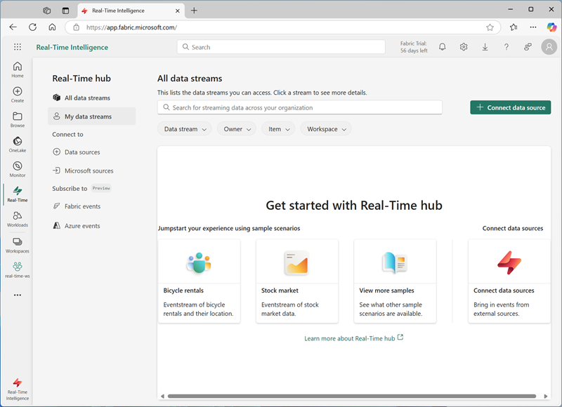

1. In the real-time hub, in the **Connect to** section, select **Data sources**.
1. Find the **Stock market** sample data source and select **Connect**. Then in the **Connect** wizard, name the source `stock` and edit the default eventstream name to change it to `stock-data`. The default stream associated with this data will automatically be named *stock-data-stream*:

    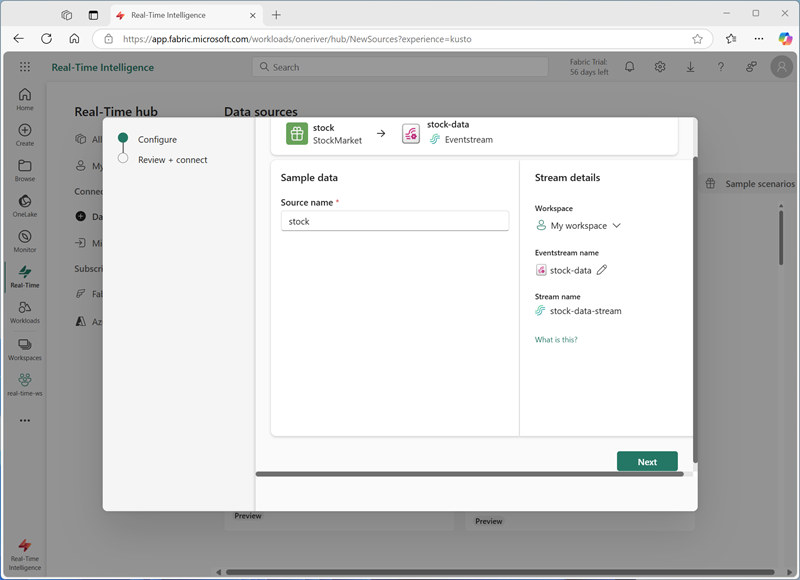

1. Select **Next** and wait for the source and eventstream to be created, then select **Open eventstream**. The eventstream will show the **stock** source and the **stock-data-stream** on the design canvas:

   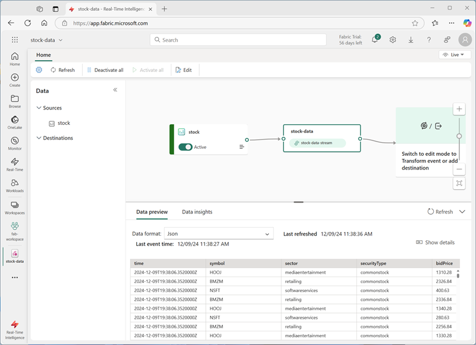

## Create an eventhouse

The eventstream ingests the real-time stock data, but doesn't currently do anything with it. Let's create an eventhouse where we can store the captured data in a table.

1. On the menu bar on the left, select **Home**; and then in the Real-Time Intelligence home page, create a new **Eventhouse**, giving it a unique name of your choice.

    Close any tips or prompts that are displayed until you see your new empty eventhouse.

    

1. In the pane on the left, note that your eventhouse contains a KQL database with the same name as the eventhouse. You can create tables for your real-time data in this database, or create additional databases as necessary.
1. Select the database, and note that there is an associated *queryset*. This file contains some sample KQL queries that you can use to get started querying the tables in your database.

    However, currently there are no tables to query. Let's resolve that problem by getting data from the eventstream into a new table.

1. In the main page of your KQL database, select **Get data**.
1. For the data source, select **Eventstream** > **Existing eventstream**.
1. In the **Select or create a destination table** pane, create a new table named `stock`. Then in the **Configure the data source** pane, select your workspace and the **stock-data** eventstream and name the connection `stock-data`.

   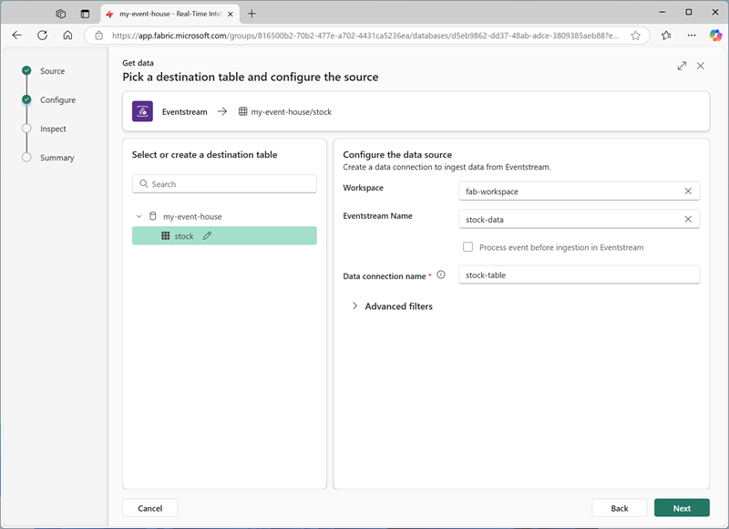

1. Use the **Next** button to complete the steps to inspect the data and then finish the configuration. Then close the configuration window to see your eventhouse with the stock table.

   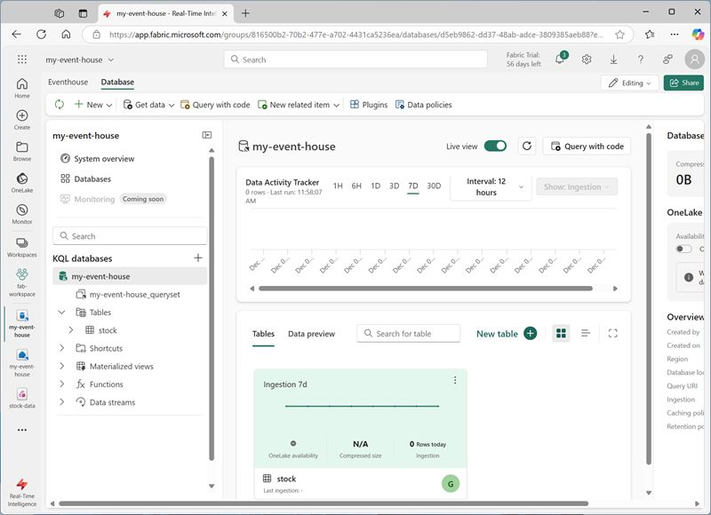

    The connection between the stream and the table has been created. Let's verify that in the eventstream.

1. In the menu bar on the left, select the **Real-Time** hub and then view the **My data streams** page. The **stock** table and the **stock-data-stream** stream should be listed.

   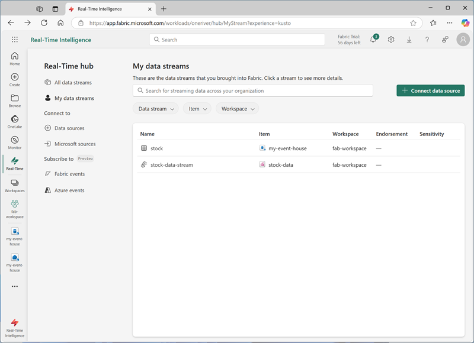

1. In the **...** menu for the **stock-data-stream** stream, select **Open eventstream**.

    The eventstream now shows a destination for the stream:

   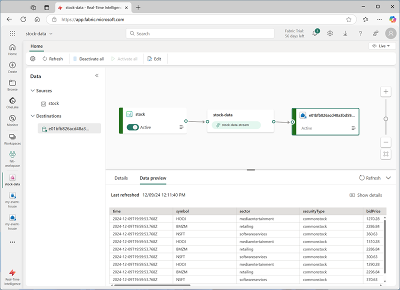

    > **Tip**: Select the destination on the design canvas, and if no data preview is shown beneath it, select **Refresh**.

    In this exercise, you've created a very simple eventstream that captures real-time data and loads it into a table. In a real soltuion, you'd typically add transformations to aggregate the data over temporal windows (for example, to capture the average price of each stock over five-minute periods).

    Now let's explore how you can query and analyze the captured data.

## Query the captured data

The eventstream captures real-time stock market data and loads it into a table in your KQL database. You can query this table to see the captured data.

1. In the menu bar on the left, select your eventhouse database.
1. Select the *queryset* for your database.
1. In the query pane, modify the first example query as shown here:

    ```kql
    stock
    | take 100
    ```

1. Select the query code and run it to see 100 rows of data from the table.

    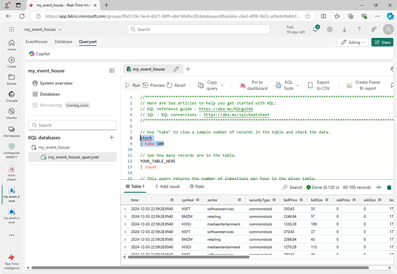

1. Review the results, then modify the query to retrieve the average price for each stock symbol in the last 5 minutes:

    ```kql
    stock
    | where ["time"] > ago(5m)
    | summarize avgPrice = avg(todecimal(bidPrice)) by symbol
    | project symbol, avgPrice
    ```

1. Highlight the modified query and run it to see the results.
1. Wait a few seconds and run it again, noting that the average prices change as new data is added to the table from the real-time stream.

## Create a real-time dashboard

Now that you have a table that is being populated by stream of data, you can use a real-time dashboard to visualize the data.

1. In the query editor, select the KQL query you used to retrieve the average stock prices for the last five minutes.
1. On the toolbar, select **Pin to dashboard**. Then pin the query **in a new dashboard** with the following settings:
    - **Dashboard name**: `Stock Dashboard`
    - **Tile name**: `Average Prices`
1. Create the dashboard and open it. It should look like this:

    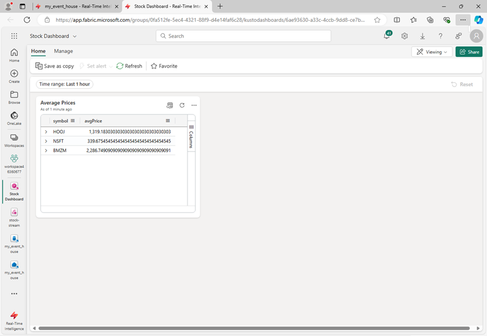

1. At the top of the dashboard, switch from **Viewing** mode to **Editing** mode.
1. Select the **Edit** (*pencil*) icon for the **Average Prices** tile.
1. In the **Visual formatting** pane, change the **Visual** from *Table* to *Column chart*:

    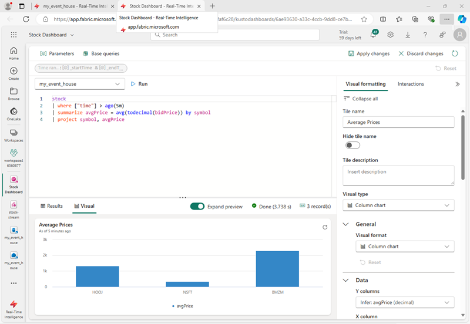

1. At the top of the dashboard, select **Apply changes** and view your modified dashboard:

    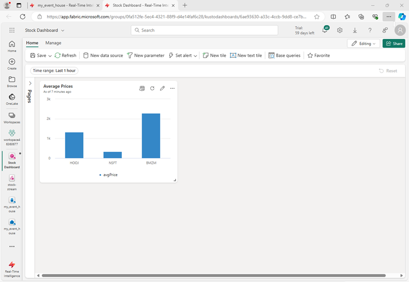

    Now you have a live visualization of your real-time stock data.

## Create an alert

Real-Time Intelligence in Microsoft Fabric includes a technology named *Activator*, which can trigger actions based on real-time events. Let's use it to alert you when the average stock price increases by a specific amount.

1. In the dashboard window containing your stock price visualization, in the toolbar, select **Set alert**.
1. In the **Set alert** pane, create an alert with the following settings:
    - **Run query every**: 5 minutes
    - **Check**: On each event grouped by
    - **Grouping field**: symbol
    - **When**: avgPrice
    - **Condition**: Increases by
    - **Value**: 100
    - **Action**: Send me an email
    - **Save location**:
        - **Workspace**: *Your workspace*
        - **Item**: Create a new item
        - **New item name**: *A unique name of your choice*

    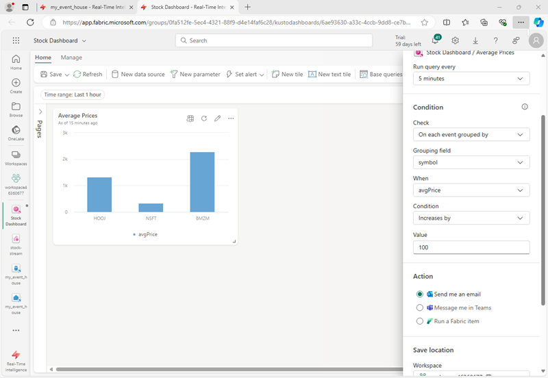

1. Create the alert and wait for it to be saved. Then close the pane confirming it has been created.
1. In the menu bar on the left, select the page for your workspace (saving any unsaved changes to your dashboard if prompted).
1. On the workspace page, view the items you have created in this exercise, including the activator for your alert.
1. Open the activator, and in its page, under the **avgPrice** node, select the unique identifier for your alert. Then view its **History** tab.

    Your alert may not have been triggered, in which case the history will contain no data. If the average stock price ever changes by more than 100, the activator will send you an email and the alert will be recorded in the history.

## Clean up resources

In this exercise, you have create an eventhouse, ingested real-time data using an eventstream, queried the ingested data in a KQL database table, created a real-time dashboard to visualize the real-time data, and configured an alert using Activator.

If you've finished exploring Real-Time Intelligence in Fabric, you can delete the workspace you created for this exercise.

1. In the bar on the left, select the icon for your workspace.
2. In the toolbar, select **Workspace settings**.
3. In the **General** section, select **Remove this workspace**.
