# Lab 04: Get started with Real-Time Dashboards in Microsoft Fabric

### Estimated Duration: 30 Minutes

Real-time dashboards in Microsoft Fabric enable you to visualize and explore streaming data using the Kusto Query Language (KQL).   
                         
In this hands-on lab, you will build an end-to-end real-time data streaming solution. Using the bicycle-eventhouse and bicycle-data event streams, you will create a dynamic real-time dashboard to visualize incoming data. The lab includes crafting a base query, incorporating parameters for interactive insights, and customizing the dashboard with additional pages. You will also configure auto-refresh settings to ensure up-to-date information and explore how to save and share the dashboard for effective collaboration.

## Lab Objectives

In this lab, you will complete the following tasks:

- Task 1: Create a real-time dashboard
- Task 2: Create a base query
- Task 3: Add a parameter
- Task 4: Add a page
- Task 5: Configure auto refresh
- Task 6: Save and share the dashboard

## Task 1: Create a real-time dashboard

In this task, you will create a real-time dashboard to visualize and monitor the data flowing through your eventstream

1. On the left navigation menu, click on **(...) (1)** and select **+ Create (2)**.

    

1. Select **Real-Time Dashboard** and name it as **`bikes-dashboard` (1)** and then click **Create (2)**.

   .png)

   .png)

   >**Note**: A new empty dashboard is created.

1. In the toolbar, select **Add data source (1)** and select **KQL Database (2)** data source. Then select **BicycleEventhouse (3)** and click on **Connect (4)**.

   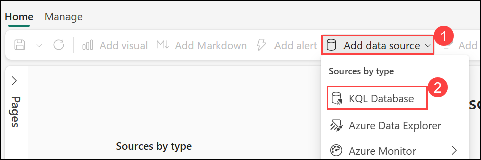

   .png)

1. Under **Data sources**, select the **Settings** icon for **BicycleEventhouse**.

    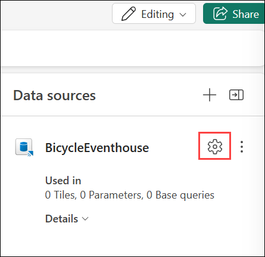

 1. On **Data sources** Settings, configure the following settings and click on **Add (4)**.

    - **Display name**: `Bike Rental Data` **(1)**
    - **Database**: BicycleEventhose **(2)**.
    - **Passthrough identity**: *Selected* **(3)**

      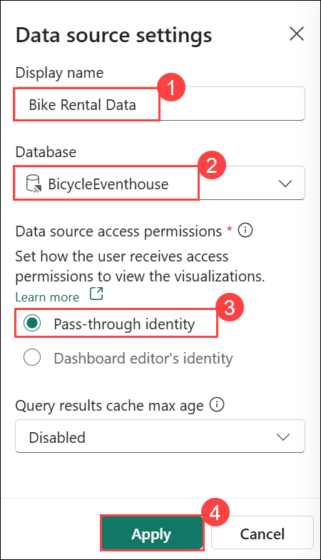

1. Close the **Data sources** pane, and then on the dashboard design canvas, select **+ Add tile**.

    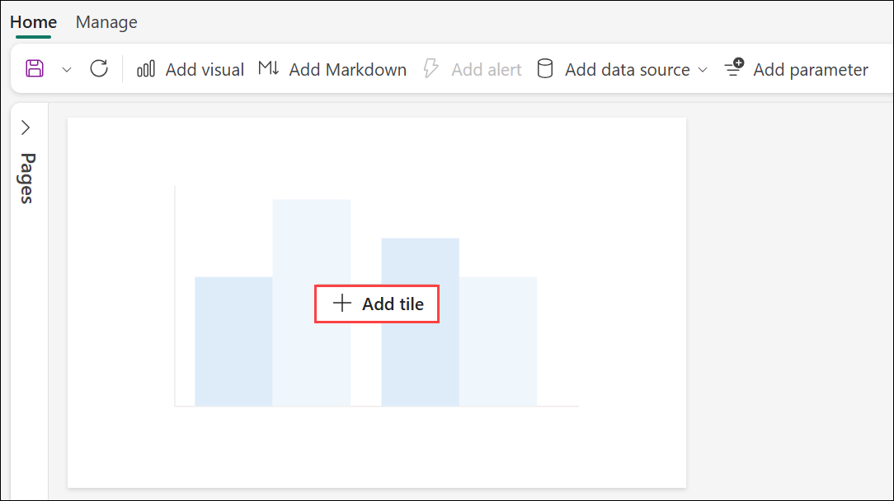

1. In the query editor, ensure that the **Bike Rental Data** source is selected and enter the following KQL code **(1)**:

    ```kql
    bikes
        | where ingestion_time() between (ago(30min) .. now())
        | summarize latest_observation = arg_max(ingestion_time(), *) by Neighbourhood
        | project Neighbourhood, latest_observation, No_Bikes, No_Empty_Docks
        | order by Neighbourhood asc
    ```

1. **Run (2)** the query, which shows the number of bikes and empty bike docks observed in each neighbourhood in the last 30 minutes under the **Results (3)** tab.

1. **Apply changes (4)** to see the data shown in a table in the tile on the dashboard.

   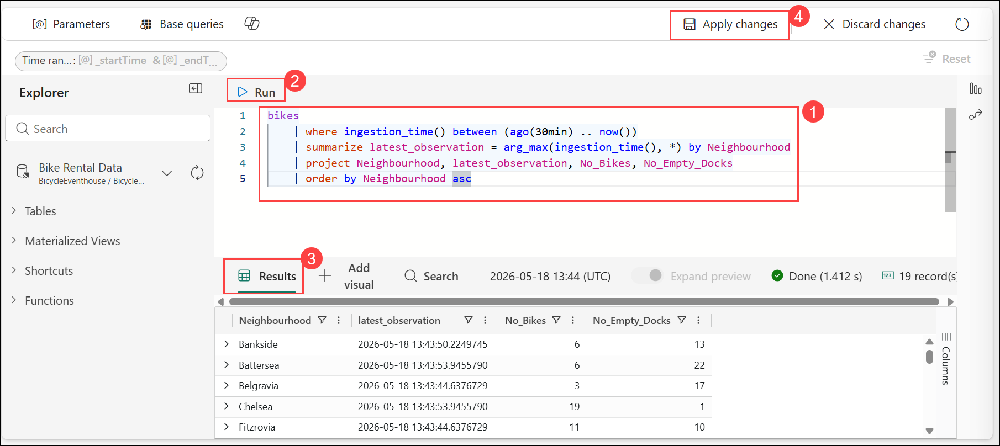

1. On the tile, select the **Edit** icon (which looks like a pencil). 

    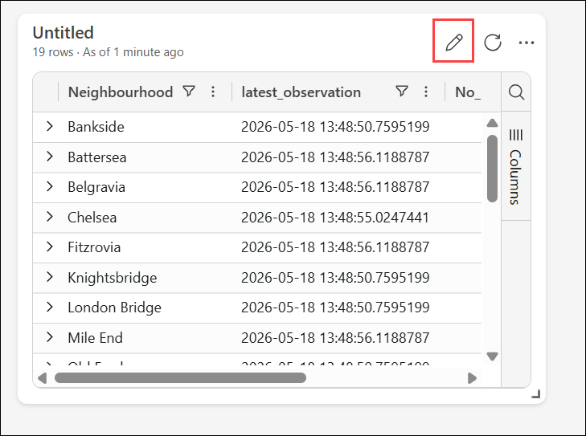

    > **Note:** If the **Copilot** pane opens automatically, close it to access the **Visual formatting** pane.

1. Select the **Visual Formatting (1)** pane, set the following properties:

    - **Visual type**: Bar chart **(2)**
    - **Visual format**: Stacked bar chart **(3)**
    - **Tile name**: Bikes and Docks **(4)**
    - **Y columns**: No_Bikes, No-Empty_Docks **(5)**
    - **X column**: Neighbourhood **(6)**
    - **Series columns**: infer **(7)**
    - **Legend location**: Bottom **(8)**
    - Click Apply Changes **(9)**.

      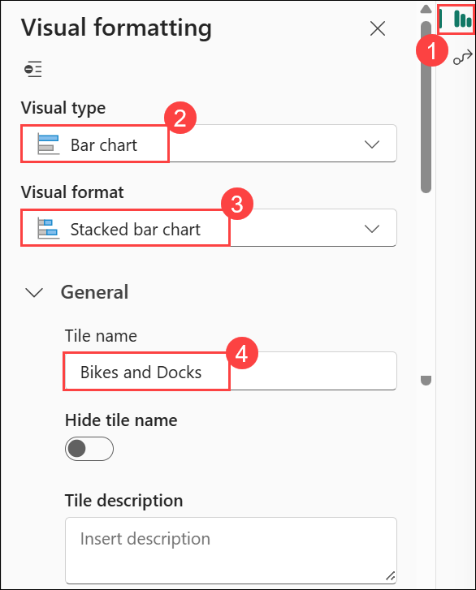

      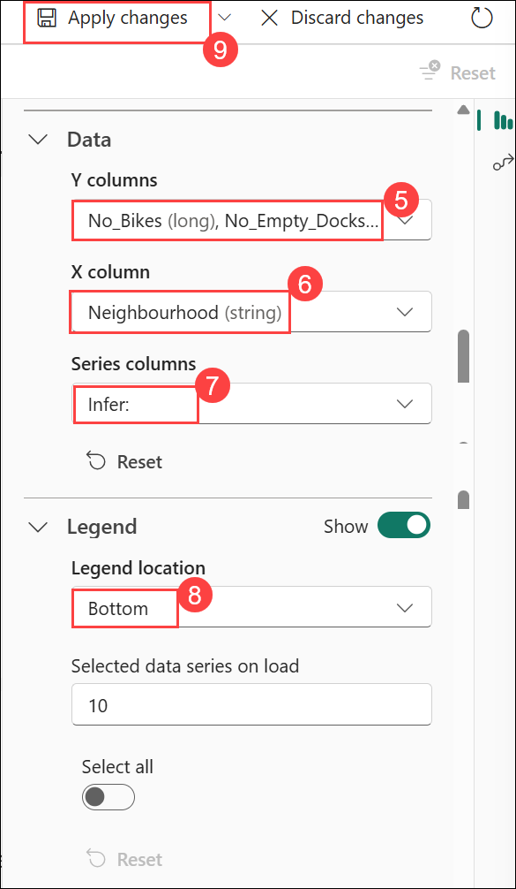

1. Resize the tile to take up the full height of the left side of the dashboard.

   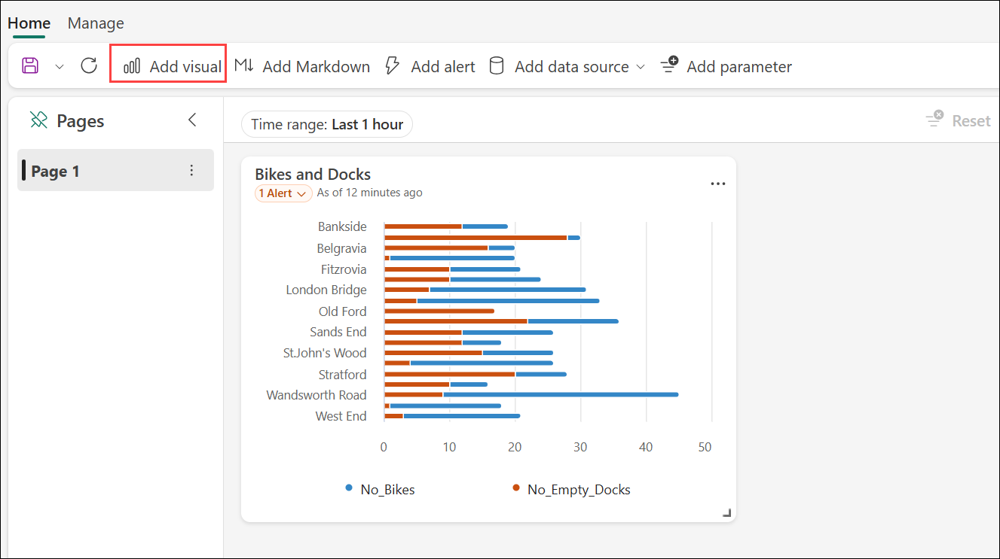

1. In the toolbar, select **Add visual**.

1. In the query editor, ensure that the **Bike Rental Data** source is selected and enter the following KQL code:

    ```kql
    bikes
        | where ingestion_time() between (ago(30min) .. now())
        | summarize latest_observation = arg_max(ingestion_time(), *) by Neighbourhood
        | project Neighbourhood, latest_observation, Latitude, Longitude, No_Bikes
        | order by Neighbourhood asc
    ```

1. Run the query, which shows the location and number of bikes observed in each neighbourhood in the last 30 minutes.

1. **Apply the changes** to see the data shown in a table in the tile on the dashboard.

1. On the tile, select the **Edit** icon (which looks like a pencil). Then in the **Visual Formatting** pane, set the following properties:

    - **Visual type**: Map
    - **Tile name**: Bike Locations
    - **Define location by**: Latitude and longitude
    - **Latitude column**: Latitude
    - **Longitude column**: Longitude
    - **Label column**: Neighbourhood
    - **Size**: Show
    - **Size column**: No_Bikes

1. **Apply the changes**, and then resize the map tile to fill the right side of the available space on the dashboard:

   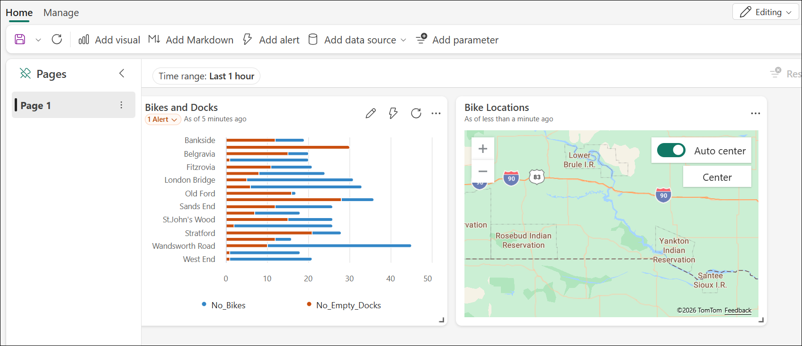

## Task 2: Create a base query

Your dashboard contains two visuals that are based on similar queries. To avoid duplication and make your dashboard more maintainable, you can consolidate the common data into a single *base query*.

In this task, you will design a base query to retrieve and structure the data that will populate the visualizations on your dashboard.

1. On the dashboard toolbar, select the **Manage (1)** tab, and then choose **Base queries (2)**. In the **Base queries** pane, select **+ Add (3)**.

    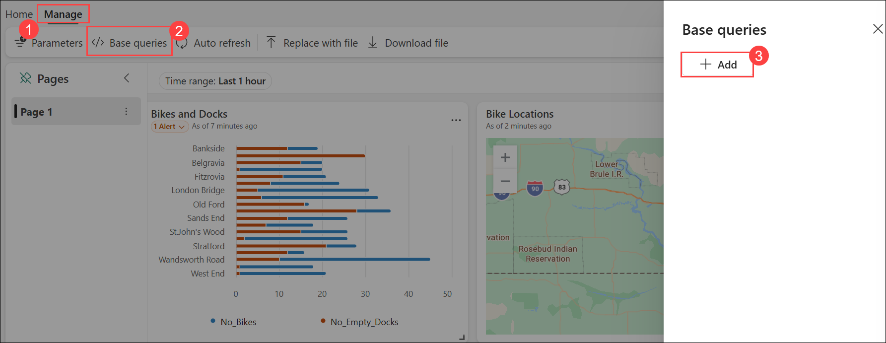

1. In the base query editor, set the **Variable name** to **`base_bike_data` (1)** and ensure that the **Bike Rental Data (2)** source is selected. Then enter the following query **(3)**:

    ```kql
    bikes
        | where ingestion_time() between (ago(30min) .. now())
        | summarize latest_observation = arg_max(ingestion_time(), *) by Neighbourhood
    ```
1. **Run (4)** the query and verify that it returns **(5)** all of the columns needed for both visuals in the dashboard (and some others).

   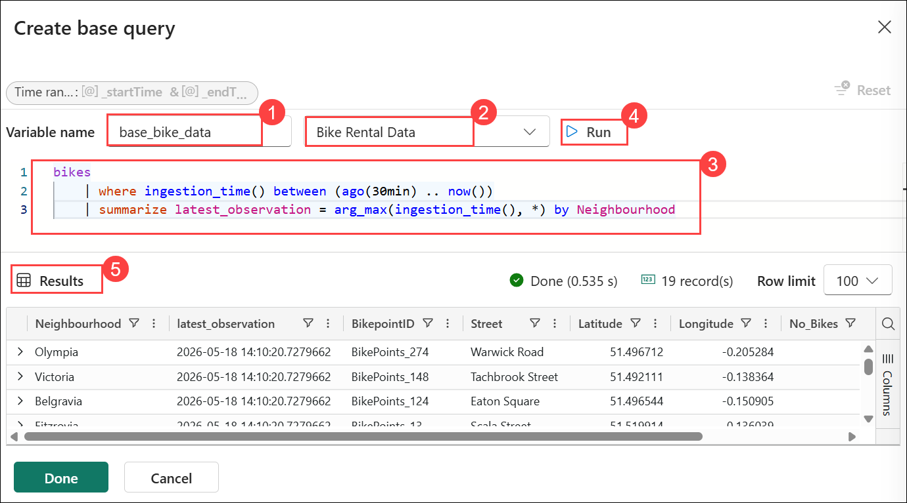

1. Select **Done** and then close the **Base queries** pane.

1. Edit the **Bikes and Docks** bar chart visual, and change the query to the following code:

    ```kql
    base_bike_data
    | project Neighbourhood, latest_observation, No_Bikes, No_Empty_Docks
    | order by Neighbourhood asc
    ```

1. Apply the changes and verify that the bar chart still displays data for all neighborhoods.

1. Edit the **Bike Locations** map visual, and change the query to the following code:

    ```kql
    base_bike_data
    | project Neighbourhood, latest_observation, No_Bikes, Latitude, Longitude
    | order by Neighbourhood asc
    ```

1. Apply the changes and verify that the map still displays data for all neighborhoods.

## Task 3: Add a parameter

Your dashboard currently shows the latest bike, dock, and location data for all neighborhoods. Now lets add a parameter so you can select a specific neighborhood.

In this task, you will add a parameter to your base query to enable dynamic filtering and interactivity within the dashboard.

1. On the dashboard toolbar, on the **Manage (1)** tab, select **Parameters (2)**.

    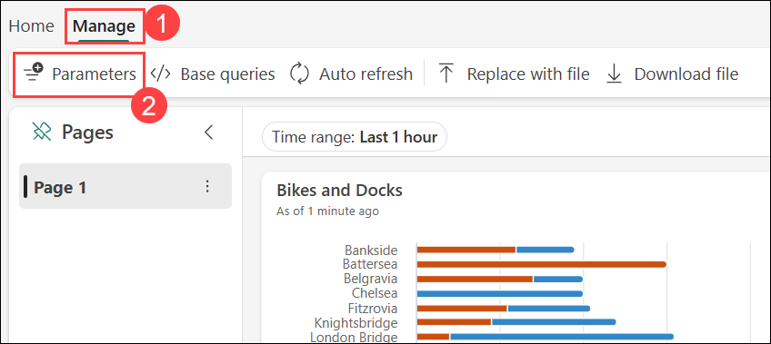

1. Note any existing parameters that have been automatically created (for example a *Time range* parameter). Then **Delete** them.

1. Select **+ Add**.

1. Add a parameter with the following settings:
    - **Label**: `Neighbourhood`
    - **Parameter type**: Multiple selection
    - **Description**: `Choose neighbourhoods`
    - **Variable name**: `selected_neighbourhoods`
    - **Data type**: string
    - **Show on pages**: Select all
    - **Source**: Query
    - **Data source**: Bike Rental Data
    - **Edit query**: Add the below query and **Run** and select **Add**

        ```kql
        bikes
        | distinct Neighbourhood
        | order by Neighbourhood asc
        ```

    - **Value column**: Neighbourhood
    - **Label column**: Match value selection
    - **Add "Select all" value**: *Selected*
    - **"Select all" sends empty string**: *Selected*
    - **Auto-reset to default value**: Selected
    - **Default value**: Select all

1. Select **Done** to create the parameter.

    Now that you've added a parameter, you need to modify the base query to filter the data based on the chosen neighborhoods.

1. In the toolbar, select **Base queries**. Then select the **base_bike_data** query and **edit** it to add an **and** condition to the **where** clause to filter based on the selected parameter values, as shown in the following code:

    ```kql
    bikes
        | where ingestion_time() between (ago(30min) .. now())
          and (isempty(['selected_neighbourhoods']) or Neighbourhood  in (['selected_neighbourhoods']))
        | summarize latest_observation = arg_max(ingestion_time(), *) by Neighbourhood
    ```

1. Select **Done** to save the base query.

1. In the dashboard, use the **Neighbourhood** parameter to filter the data based on the neighborhoods you select.

   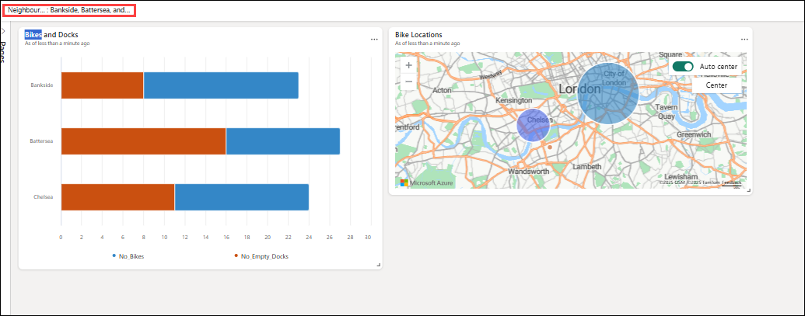

1. Select **Reset** to remove the selected parameter filters.

## Task 4: Add a page

Your dashboard currently consists of a single page. You can add more pages to provide more data.

In this task, you will add an additional page to your dashboard to organize different visualizations and enhance usability.

1. On the left side of the dashboard, expand the **Pages** pane and select **+ Add page**.

    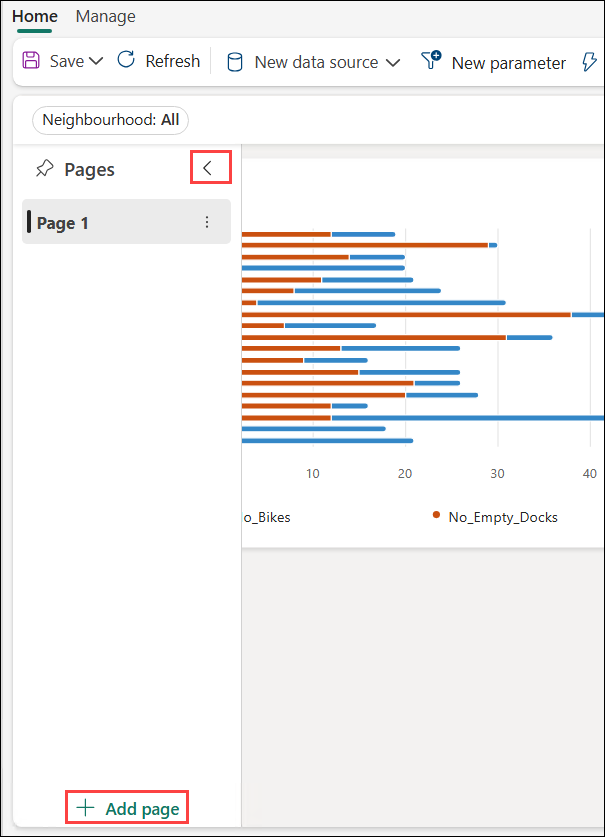

1. Name the new page **Page 2**. Then select it.

1. On the new page, select **+ Add tile**

1. In the query editor for the new tile, enter the following query:

    ```kql
    base_bike_data
    | project Neighbourhood, latest_observation
    | order by latest_observation desc
    ```

1. Apply the changes. Then, resize the tile to fill the height of the dashboard.

   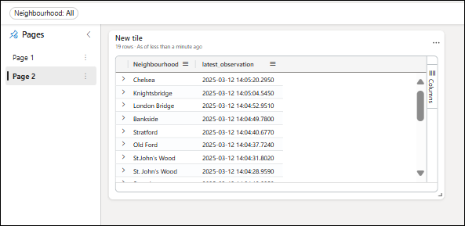

## Task 5: Configure auto refresh

Users can manually refresh the dashboard, but it may be useful to have it automatically refresh the data at a set interval.

In this task, you will configure the dashboard’s auto-refresh settings to ensure that the data visualizations are updated in real time.

1. On the dashboard toolbar, on the **Manage (1)** tabe, select **Auto refresh (2)**.

    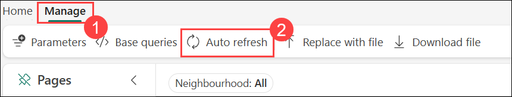

1. In the **Auto refresh** pane, configure the following settings:

    - **Enabled**: *Selected* **(1)**
    - **Minimum time interval**: Allow all refresh intervals **(2)**
    - **Default refresh rate**: 30 minutes **(3)**
    - Click **Apply (4)**.

        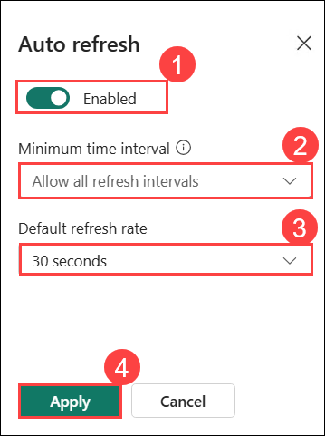

## Task 6: Save and share the dashboard

Now you have a useful dashboard, you can save it and share it with other users.

In this task, you will save your dashboard and configure sharing settings to collaborate with others and allow broader access to real-time insights.

1. On the dashboard toolbar, select **Save**.

    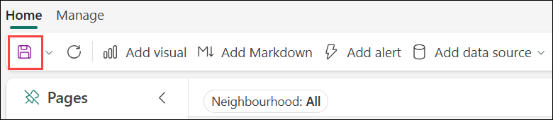

1. When the dashboard is saved, select **Share**.

    .png)

1. On the **Share** dialog box, select **Copy link** and copy the link to the dashboard to the clipboard.

    .png)

    .png)

1. Open a new browser tab and paste the copied link to navigate to the shared dashboard. Sign in again with your credentials if prompted.

    >**Note:** Ignore the Errors applying link message and click **Close**.

    .png)

1. Explore the dashboard, using it to see the latest information about bikes and empty bike docks across the city.


## Review    

In this lab, you learned how to:

- Created a real-time dashboard
- Created a base query
- Added a parameter
- Added a page
- Configured auto refresh
- Saved and shared the dashboard

## You have successfully completed the lab.
