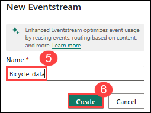
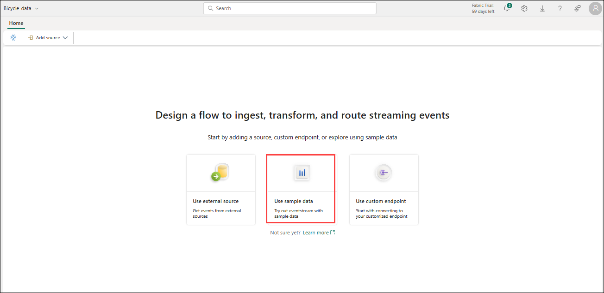
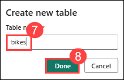
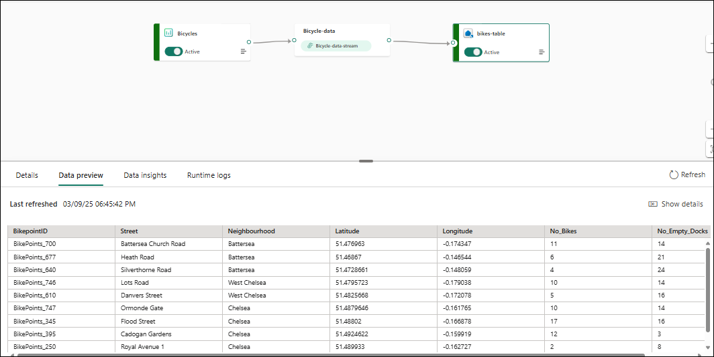
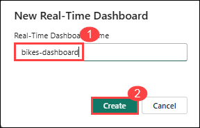
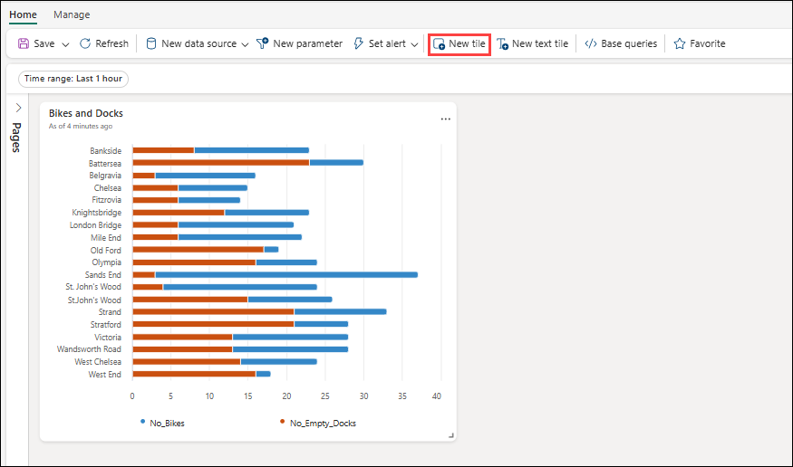

# Lab 1: Get started with Real-Time Dashboards in Microsoft Fabric

## Estimated Duration: 60 minutes

Real-time dashboards in Microsoft Fabric enable you to visualize and explore streaming data using the Kusto Query Language (KQL).  In this exercise, you'll explore how to create and use a real-time dashboard based on a real-time data source.

## Create an eventhouse

Now that you have a workspace, you can start creating the Fabric items you'll need for your real-time intelligence solution. we'll start by creating an eventhouse.

1. In the workspace, select **+ New item (1)**. In the *New item* pane, select **Eventhouse (2)**.

   

1. Enter **BicycleEventhouse (1)** in the name field and select **Create (2)**

    

1. Close any tips or prompts that are displayed until you see your new empty eventhouse.

1. In the pane on the left, note that your eventhouse contains a KQL database with the same name as the eventhouse.

1. Select the KQL database to view it.

    

    >**Note**: Currently there are no tables in the database. In the rest of this exercise you'll use an eventstream to load data from a real-time source into a table.

## Create an eventstream

Currently there are no tables in the database. We'll use an eventstream to load data from a real-time source into a table.

1. In the main page of your **KQL database (1)**, select **Get data (2)**.

2. For the data source, select **Eventstream (3)** > **New eventstream (4)**. Name the Eventstream `Bicycle-data` (5) and click on **Create (6)**.

   >**Note**: The creation of your new event stream in the workspace will be completed in just a few moments. Once established, you will be automatically redirected to the primary editor, ready to begin integrating sources into your event stream.

    

    

    

## Add a source

1. In the Eventstream canvas, select **Use sample data**.

2. Name the source `Bicycles` (1), and select the **Bicycles (2)** sample data and select **Add (3)**

    

   >**Note**: Your stream will be mapped and you will be automatically displayed on the **eventstream canvas**.

   

## Add a destination

1. Select the **Transform events or add destination (1)** tile and search for **Eventhouse (2)**.

   

1. In the **Eventhouse** pane, configure the following setup options.

   - **Data ingestion mode:**: Event processing before ingestion (1)
   - **Destination name:** `bikes-table` (2)
   - **Workspace:** fabric-<inject key="DeploymentID" enableCopy="false"/> (3)
   - **Eventhouse**: BicycleEventhouse (4)
   - **KQL database:** BicycleEventhouse (5)
   - **Destination table:** Create a new table named `bikes` 
   - **Input data format:** JSON (9)

   

   

   

1. In the **Eventhouse** pane, select **Save (10)**

1. On the toolbar, select **Publish**.

   

1. Wait a minute or so for the data destination to become active. Then select the **bikes-table** node in the design canvas and view the **Data preview** pane underneath to see the latest data that has been ingested:

   

1. Wait a few minutes and then use the **Refresh** button to refresh the **Data preview** pane. The stream is running perpetually, so new data may have been added to the table.

## Create a real-time dashboard

Now that you have a stream of real-time data being loaded into a table in the eventhouse, you can visualize it with a real-time dashboard.

1. In the menu bar on the left, select **+ create** to create a new **Real-Time Dashboard** named `bikes-dashboard`.

    

    

   >**Note**: A new empty dashboard is created.

1. In the toolbar, select **New data source (1)** and select **Eventhouse/KQL Database (2)** data source. Then select **BicycleEventhouse (3)** and click on **Connect (4)**

    

    

 1. Create a new data source with the following settings and click on **Add (4)**

    - **Display name**: `Bike Rental Data` (1)
    - **Database**: *BicycleEventhose (2)*.
    - **Passthrough identity**: *Selected*

    

1. Close the **Data sources** pane, and then on the dashboard design canvas, select **Add tile**.

1. In the query editor, ensure that the **Bike Rental Data (2)** source is selected and enter the following KQL code:

    ```kql
    bikes
        | where ingestion_time() between (ago(30min) .. now())
        | summarize latest_observation = arg_max(ingestion_time(), *) by Neighbourhood
        | project Neighbourhood, latest_observation, No_Bikes, No_Empty_Docks
        | order by Neighbourhood asc
    ```

1. **Run (3)** the query, which shows the number of bikes and empty bike docks observed in each neighbourhood in the last 30 minutes.

1. **Apply changes (5)** to see the data shown in a table in the tile on the dashboard.

   

   

1. On the tile, select the **Edit** icon (which looks like a pencil). Then in the **Visual Formatting** pane, set the following properties:
    - **Tile name**: Bikes and Docks
    - **Visual type**: Bar chart
    - **Visual format**: Stacked bar chart
    - **Y columns**: No_Bikes, No-Empty_Docks
    - **X column**: Neighbourhood
    - **Series columns**: infer
    - **Legend location**: Bottom

    

    

1. Apply the changes and then resize the tile to take up the full height of the left side of the dashboard.

    

1. In the toolbar, select **New tile**

1. In the query editor, ensure that the **Bike Rental Data** source is selected and enter the following KQL code:

    ```kql
    bikes
        | where ingestion_time() between (ago(30min) .. now())
        | summarize latest_observation = arg_max(ingestion_time(), *) by Neighbourhood
        | project Neighbourhood, latest_observation, Latitude, Longitude, No_Bikes
        | order by Neighbourhood asc
    ```

1. Run the query, which shows the location and number of bikes observed in each neighbourhood in the last 30 minutes.

1. Apply the changes to see the data shown in a table in the tile on the dashboard.

1. On the tile, select the **Edit** icon (which looks like a pencil). Then in the **Visual Formatting** pane, set the following properties:
    - **Tile name**: Bike Locations
    - **Visual type**: Map
    - **Define location by**: Latitude and longitude
    - **Latitude column**: Latitude
    - **Longitude column**: Longitude
    - **Label column**: Neighbourhood
    - **Size**: Show
    - **Size column**: No_Bikes

1. Apply the changes, and then resize the map tile to fill the right side of the available space on the dashboard:

   

## Create a base query

Your dashboard contains two visuals that are based on similar queries. To avoid duplication and make your dashboard more maintainable, you can consolidate the common data into a single *base query*.

1. On the dashboard toolbar, select **Base queries**. Then select **+Add**.

1. In the base query editor, set the **Variable name** to `base_bike_data` (1) and ensure that the **Bike Rental Data (2)** source is selected. Then enter the following query (3):

    ```kql
    bikes
        | where ingestion_time() between (ago(30min) .. now())
        | summarize latest_observation = arg_max(ingestion_time(), *) by Neighbourhood
    ```
1. **Run (4)** the query and verify that it returns all of the columns needed for both visuals in the dashboard (and some others).

   

1. Select **Done** and then close the **Base queries** pane.

1. Edit the **Bikes and Docks** bar chart visual, and change the query to the following code:

    ```kql
    base_bike_data
    | project Neighbourhood, latest_observation, No_Bikes, No_Empty_Docks
    | order by Neighbourhood asc
    ```

1. Apply the changes and verify that the bar chart still displays data for all neighborhoods.

1. Edit the **Bike Locations** map visual, and change the query to the following code:

    ```kql
    base_bike_data
    | project Neighbourhood, latest_observation, No_Bikes, Latitude, Longitude
    | order by Neighbourhood asc
    ```

1. Apply the changes and verify that the map still displays data for all neighborhoods.

## Add a parameter

Your dashboard currently shows the latest bike, dock, and location data for all neighborhoods. Now lets add a parameter so you can select a specific neighborhood.

1. On the dashboard toolbar, on the **Manage** tab, select **Parameters**.
1. Note any existing parameters that have been automatically created (for example a *Time range* parameter). Then **Delete** them.
1. Select **+ Add**.
1. Add a parameter with the following settings:
    - **Label**: `Neighbourhood`
    - **Parameter type**: Multiple selection
    - **Description**: `Choose neighbourhoods`
    - **Variable name**: `selected_neighbourhoods`
    - **Data type**: string
    - **Show on pages**: Select all
    - **Source**: Query
    - **Data source**: Bike Rental Data
    - **Edit query**:

        ```kql
        bikes
        | distinct Neighbourhood
        | order by Neighbourhood asc
        ```

    - **Value column**: Neighbourhood
    - **Label column**: Match value selection
    - **Add "Select all" value**: *Selected*
    - **"Select all" sends empty string**: *Selected*
    - **Auto-reset to default value**: Selected
    - **Default value**: Select all

1. Select **Done** to create the parameter.

    Now that you've added a parameter, you need to modify the base query to filter the data based on the chosen neighborhoods.

1. In the toolbar, select **Base queries**. Then select the **base_bike_data** query and edit it to add an **and** condition to the **where** clause to filter based on the selected parameter values, as shown in the following code:

    ```kql
    bikes
        | where ingestion_time() between (ago(30min) .. now())
          and (isempty(['selected_neighbourhoods']) or Neighbourhood  in (['selected_neighbourhoods']))
        | summarize latest_observation = arg_max(ingestion_time(), *) by Neighbourhood
    ```

1. Select **Done** to save the base query.

1. In the dashboard, use the **Neighbourhood** parameter to filter the data based on the neighborhoods you select.

   

1. Select **Reset** to remove the selected parameter filters.

## Add a page

Your dashboard currently consists of a single page. You can add more pages to provide more data.

1. On the left side of the dashboard, expand the **Pages** pane; and select **+ Add page**.
1. Name the new page **Page 2**. Then select it.
1. On the new page, select **+ Add tile**
1. In the query editor for the new tile, enter the following query:

    ```kql
    base_bike_data
    | project Neighbourhood, latest_observation
    | order by latest_observation desc
    ```

1. Apply the changes. Then resize the tile to fill the height of the dashboard.

   

## Configure auto refresh

Users can manually refresh the dashboard, but it may be useful to have it automatically refresh the data at a set interval.

1. On the dashboard toolbar, on the **Manage** tabe, select **Auto refresh**.

1. In the **Auto refresh** pane, configure the following settings:

    - **Enabled**: *Selected*
    - **Minimum time interval**: Allow all refresh intervals
    - **Default refresh rate**: 30 minutes

1. Apply the auto refresh settings.

## Save and share the dashboard

Now you have a useful dashboard, you can save it and share it with other users.

1. On the dashboard toolbar, select **Save**.

1. When the dashboard is saved, select **Share**.

1. On the **Share** dialog box, select **Copy link** and copy the link to the dashboard to the clipboard.

1. Open a new browser tab and paste the copied link to navigate to the shared dashboard. Sign in again with your credentials if prompted.

1. Explore the dashboard, using it to see the latest information about bikes and empty bike docks across the city.
