# Lab 1: Monitor Fabric activity in the monitoring hub

## Estimated Duration : 45 minutes

The *monitoring hub* in Microsoft Fabric provides a central place where you can monitor activity. You can use the monitoring hub to review events related to items you have permission to view.

In this hands-on lab, you will explore how to monitor activities in Microsoft Fabric using the monitoring hub. You will create and run different Fabric artifacts like lakehouses, dataflows, and notebooks, and learn how to track and review their execution history. Additionally, you will practice customizing views in the monitoring hub to effectively manage large volumes of activity logs.

## Lab Objectives

In this lab, you will complete the following tasks:

- **Task 1**: Create a lakehouse

- **Task 2**: Create and monitor a Dataflow

- **Task 3**: Create and monitor a Spark notebook

- **Task 4**: Monitor history for an item

- **Task 5**: Customize monitoring hub views

### Task 1: Create a lakehouse

In this task, you will create a lakehouse in your Microsoft Fabric workspace. 

1. Return to your workspace and click the **+ New item (1)** icon.  

2. On the **All items** page, scroll down to the **Store data** section and select **Lakehouse (2)**.  

     

3. Provide the following details to create a **Lakehouse**:  

   - **Name:** Enter **lakehouse<inject key="DeploymentID" enableCopy="false"/>**  

4. Click **Create** to proceed.  

5. View the new lakehouse, and note that the **Lakehouse explorer** pane on the left enables you to browse tables and files in the lakehouse:

    - The **Tables** folder contains tables that you can query using SQL semantics. Tables in a Microsoft Fabric lakehouse are based on the open source *Delta Lake* file format, commonly used in Apache Spark.

    - The **Files** folder contains data files in the OneLake storage for the lakehouse that aren't associated with managed delta tables. You can also create *shortcuts* in this folder to reference data that is stored externally.

   

   >**Note**: Currently, there are no tables or files in the lakehouse.

### Task 2: Create and monitor a Dataflow

In Microsoft Fabric, you can use a Dataflow (Gen2) to ingest data from a wide range of sources. In this exercise, you'll use a dataflow to get data from a CSV file and load it into a table in your lakehouse.

In this task, you will create a Dataflow Gen2 to ingest data from a CSV file into the lakehouse. You will publish the dataflow and monitor its execution status using the monitoring hub.

1. On the **Home** page for your lakehouse, in the **Get data in your lakehouse** menu, select **New Dataflow Gen2**.

1. A new dataflow named **Dataflow 1** is created and opened.

    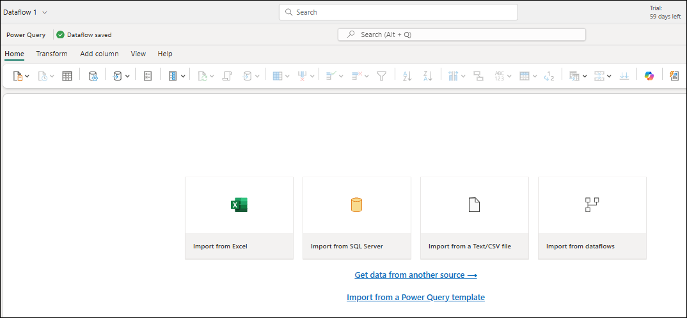

1. At the top left of the dataflow page, select **Dataflow 1 (1)** to see its details and rename the dataflow to **Get Product Data (2)**.

   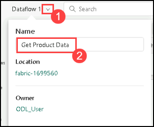

1. In the dataflow designer, select **Import from a Text/CSV file**. Then complete the Get Data wizard to create a data connection by linking to `https://raw.githubusercontent.com/MicrosoftLearning/dp-data/main/products.csv (1)` using anonymous authentication. 

    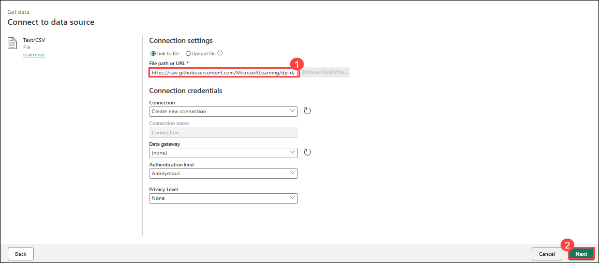

1. Click on **Next (2)**

1. When you have completed the wizard, a preview of the data will be shown in the dataflow designer like below and click on **Create**

    

1. Click on **Save & run** the dataflow.

    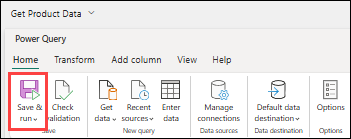

1. In the navigation bar on the left, select **Monitor** to view the monitoring hub and observe that your dataflow is in-progress (if not, refresh the view until you see it).

    

1. Wait for a few seconds, and then refresh the page until the status of the dataflow is **Succeeded**.

1. In the navigation pane, select your **lakehouse**. Then expand the **Tables** folder to verify that a table named **products** has been created and loaded by the dataflow (you may need to refresh the **Tables** folder).

    

### Task 3: Create and monitor a Spark notebook

In this task, you will use a Spark notebook to query the ingested data from the lakehouse. You will run Spark code, stop the session, and monitor the notebook’s execution through the monitoring hub.

1. In the lakehouse interface, Select **Open notebook (1)**, then choose **New notebook (2)** to create a new one.

    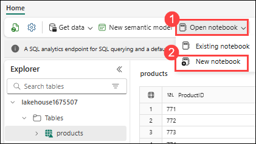

1. A new notebook named **Notebook 1** is created and opened.

1. At the top left of the notebook, select **Notebook 1 (1)** to view its details, and change its name to **Query Products (2)**.

   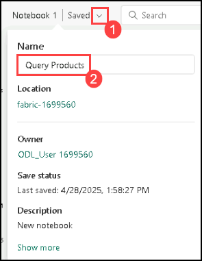

1. In the notebook editor, in the **Explorer** pane, select **lakehouse<inject key="DeploymentID" enableCopy="false"/>**

1. In the **...** menu for the **Products** table, select **Load data** > **Spark**. This adds a new code cell to the notebook as shown here:

    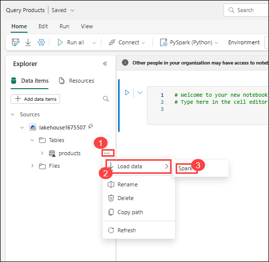

1. Use the **&#9655; Run all** button to run all cells in the notebook. It will take a moment or so to start the Spark session, and then the results of the query will be shown under the code cell.

    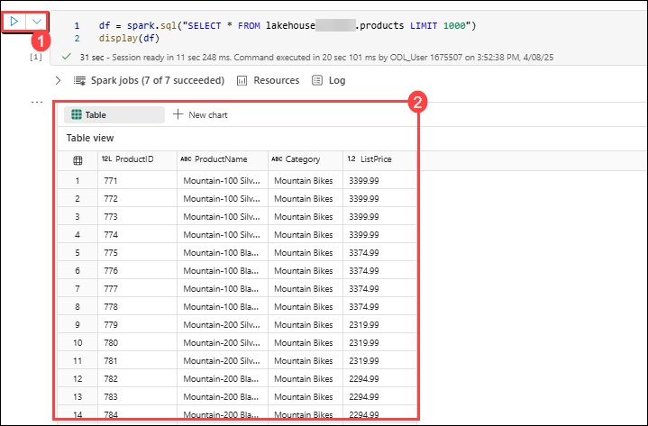

1. On the toolbar, use the **&#9723;** (*Stop session*) button to stop the Spark session.

1. In the navigation bar, select **Monitor** to view the monitoring hub, and note that the notebook activity is listed.

    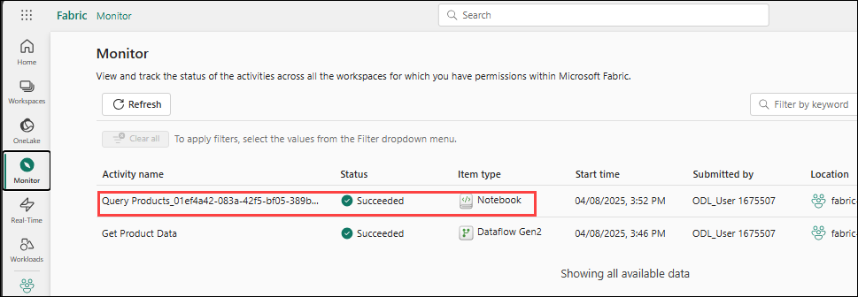

### Task 4: Monitor history for an item

Some items in a workspace might be run multiple times. You can use the monitoring hub to view their run history.

In this task, you will rerun the dataflow and view the historical run history in the monitoring hub. You will also explore detailed run information for each execution instance.

1. In the navigation bar, return to the page for your workspace. Then use the **&#8635;** (*Refresh now*) button for your **Get Product Data** dataflow to re-run it.

    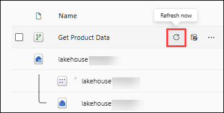

1. In the navigation pane, select the **Monitor** page to view the monitoring hub and verify that the dataflow is in-progress.

    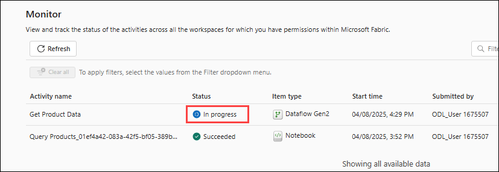

1. In the **...** menu for the **Get Product Data** dataflow, select **Historical runs** to view the run history for the dataflow:

1. Use the **Back to main view** button to return to the main monitoring hub page.

### Task 5: Customize monitoring hub views

In this task, you will learn how to apply filters and adjust columns to customize your monitoring hub view, making it easier to locate and analyze specific activities in environments with a large number of events.

1. In the monitoring hub, use the **Filter** button to apply the following filter:
    - **Status**: Succeeeded
    - **Item type**: Dataflow Gen2

    With the filter applied, only successful runs of dataflows are listed.

    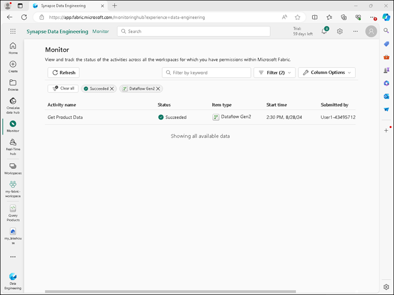

1. Use the **Column Options** button to include the following columns in the view (use the **Apply** button to apply the changes):
    - Activity name
    - Status
    - Item type
    - Start time
    - Submitted by
    - Location
    - End time
    - Duration
    - Refresh type
  
   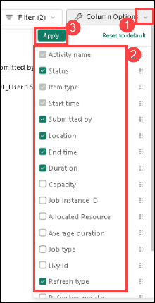

    **You may need to scroll horizontally to see all of the columns**

## Review

In this lab, you learned how to:

- Create and manage a lakehouse in Microsoft Fabric.

- Ingest data into a lakehouse using a Dataflow Gen2.

- Query lakehouse data using a Spark notebook.

- Monitor and track activity execution history through the monitoring hub.

- Apply filters and customize columns to optimize the monitoring experience.

## You have successfully completed the lab. Click on Next >> to procced with next Lab.

