# Lab 2: Secure data access in Microsoft Fabric

## Estimated Duration : 45 minutes

Microsoft Fabric has a multi-layer security model for managing data access. Security can be set for an entire workspace, for individual items, or through granular permissions in each Fabric engine. In this exercise, you secure data using workspace, and item access controls and OneLake data access roles

In this hands-on lab, you will learn how to secure data access within Microsoft Fabric by applying workspace access controls, item-level permissions, and OneLake data access roles. You'll experience how different levels of access impact the ability to view and interact with data in Data Warehouses and Lakehouses. By the end of this lab, you’ll understand how to configure and validate security settings at multiple layers to protect sensitive information in Microsoft Fabric.

## Lab Objectives

In this lab, you will complete the following tasks:

- **Task 1**: Create a data warehouse

- **Task 2**: Create a lakehouse

- **Task 3**: Apply workspace access controls

- **Task 4**: Apply item access control

- **Task 5**: Apply OneLake data access roles in a Lakehouse

### Task 1: Create a data warehouse

In this task, you will create a sample data warehouse named sample-dw prepopulated with taxi ride analysis data

1. On the menu bar on the left, select **Create**. In the *New* page, under the ***Data Warehouse*** section, select **Sample warehouse** and create a new data warehouse named **sample-dw**.

    >**Note**: If the **Create** option is not pinned to the sidebar, you need to select the ellipsis (**...**) option first.

    After a minute or so, a new warehouse will be created and populated with sample data for a taxi ride analysis scenario.

    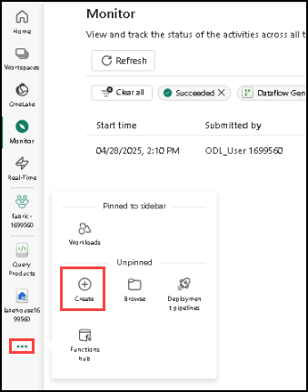
   
    
   
    

### Task 2: Create a lakehouse

In this task, you will create a new Lakehouse, populate it with sample data, and prepare it for access control exercises.

1. In the menu bar on the left, select **Workspaces** (the icon looks similar to 🗇).

1. Select the workspace you created.

1. In the workspace, select the **+ New Item** button and then select **Lakehouse**. Create a new Lakehouse with the name **lakehouse2**.

1. After a minute or so, a new Lakehouse will be created.

1. Select the **Start with sample data** tile, then on the **Use a Sample** page, choose the **Public holidays** tile to populate the workspace with sample data.

    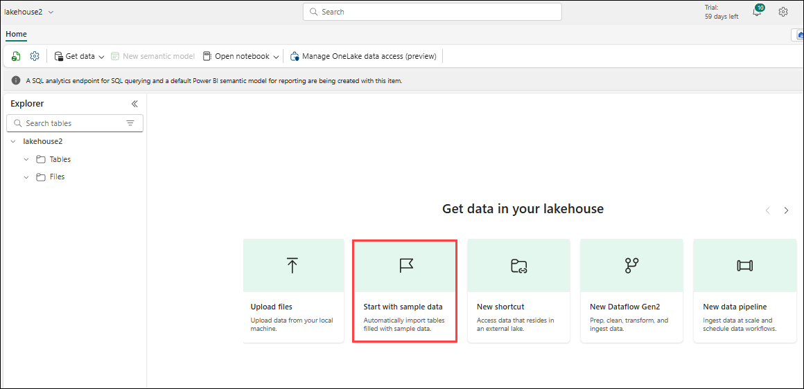
   
    

### Task 3: Apply workspace access controls

Workspace roles are used to control access to workspaces and the content within them. Workspace roles can be assigned when users need to see all items in a workspace, when they need to manage workspace access, or create new Fabric items, or when they need specific permissions to view, modify or share content in the workspace.  

In this task, you add a user to a workspace role, apply permissions and, see what is viewable when each set of permissions is applied. You open two browsers and sign-in as different users. In one browser, you'll be a **Workspace Admin** and in the other, you'll sign-in as a second, less privileged user. In one browser, the Workspace Admin changes permissions for the second user and in the second browser, you're able to see the effects of changing permissions.  

1. In the menu bar on the left, select **Workspaces** (the icon looks similar to &#128455;).
1. Next select the workspace you created.
1. Select on **Manage access** on the top of the screen.

    

    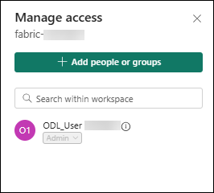

    >**Note**: You'll see the user you're logged, who is a a member of the **Workspace Admin** role because you created the workspace. No other users are assigned access to the workspace yet.

1. Next, you'll see what a user without permissions on the workspace can view. In the Microsoft Edge browser, click the ellipsis (three dots) in the top-right corner and select **New InPrivate window**.

1. Enter *https://app.fabric.microsoft.com/home?experience=fabric-developer* and sign-in as the second user with the below credentials, click on **try for free**:

    - Email : <inject key="testuser" enableCopy="true"/>

    - Password : <inject key="test user Password" enableCopy="true"/>  
  
1. On the bottom left corner of your screen, select **Microsoft Fabric**. Next select **Workspaces** (the icon looks similar to &#128455;).

   > **Note:** `The second user doesn't have access to the workspace, so it's not viewable.`

1. Next, you assign the **Workspace Viewer** role to the second user and see that the role grants read access to the warehouse in the workspace.
  
1. Return to the browser window where you're logged in as the Workspace Admin. Ensure you're still on the page that shows the workspace you created. It should have your new workspace items, and the sample warehouse and lakehouse, listed at the bottom of the page.
1. Select **Manage access** at the top right of the screen.
1. Select **Add people or groups**. Enter the email of the second user - <inject key="testuser" enableCopy="true"/>.
 . Select **Add** to assign the user to the workspace **Viewer** role. 

    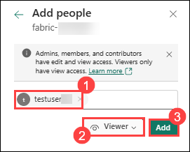

1. Return to the **InPrivate browser window** where you're logged in as the **second user** and select **refresh** button on the browser to refresh session permissions assigned to the second user.

1. Select the **Workspaces** icon on the left menu bar (the icon looks similar to &#128455;) and select on the workspace name you created as the Workspace Admin user. The second user can now see all of the items in the workspace because they were assigned the **Workspace Viewer** role.

   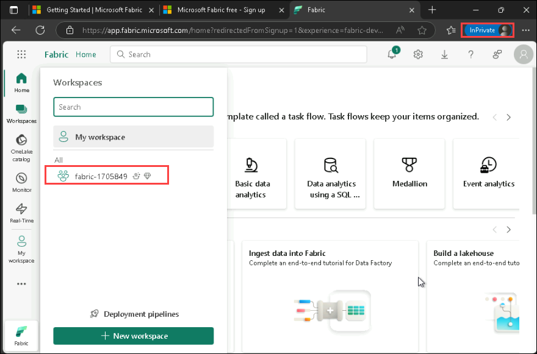

1. Select the **warehouse** and open it.

   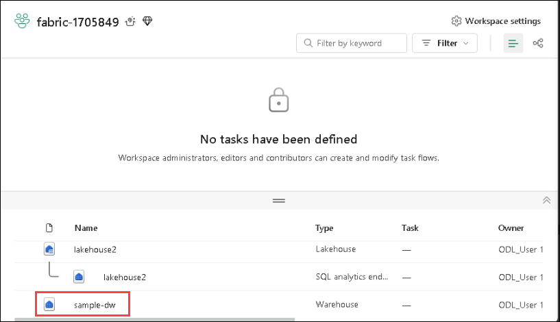

1. Under the **sample-dw > Schema > dbo > Tables > Date** and Select the **Date** table and wait for the rows to be loaded. You can see the rows because as a member of the Workspace Viewer role, you have CONNECT and ReadData permission on tables in the warehouse. For more information on permissions granted to the Workspace Viewer role, see [Workspace roles](https://learn.microsoft.com/en-us/fabric/data-warehouse/workspace-roles).

   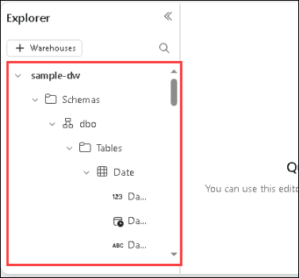

1. Next, select the **fabric Workspaces** on the left menu bar, then select the *lakehouse2*.
   
1. When the lakehouse opens, click on the dropdown box at the top right corner of the screen that says **Lakehouse** and select **SQL analytics endpoint**.

   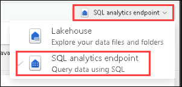
   
1. Select the **publicholidays** table and wait for the data to be displayed. Data in the lakehouse table is readable from the SQL analytics endpoint because the user is a member of the Workspace Viewer role that grants read permissions on the SQL analytics endpoint.

   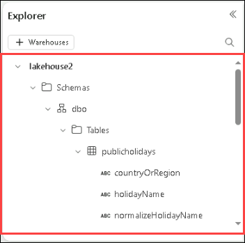

### Task 4: Apply item access control

Item permissions control access to individual Fabric items within a workspace, like warehouses, lakehouses and semantic models. In this exercise, you remove the **Workspace Viewer** permissions applied in the previous exercise and then apply item level permissions on the warehouse so a less privileged user can only view the warehouse data, not the lakehouse data.

In this task, you will configure item-level permissions by granting access to specific Fabric items like warehouses, limiting user visibility to only assigned resources.

1. Return to the browser window where you're logged in as the Workspace Admin. Select **Workspaces** from the left navigation pane.
   
3. Select the workspace that you created to open it.
   
5. Select **Manage access** from the top of the screen.
   
7. Select the word **Viewer** under the name of the second user. On the menu that appears, select **Remove**.

   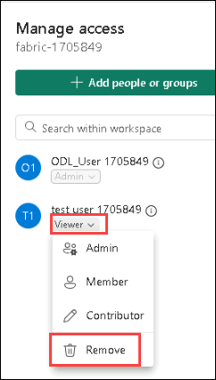

9. Close the **Manage access** section.
   
10. In the workspace, hover over the name of your warehouse and an ellipse (**...**) will appear. Select the ellipse and select **Manage permissions**

    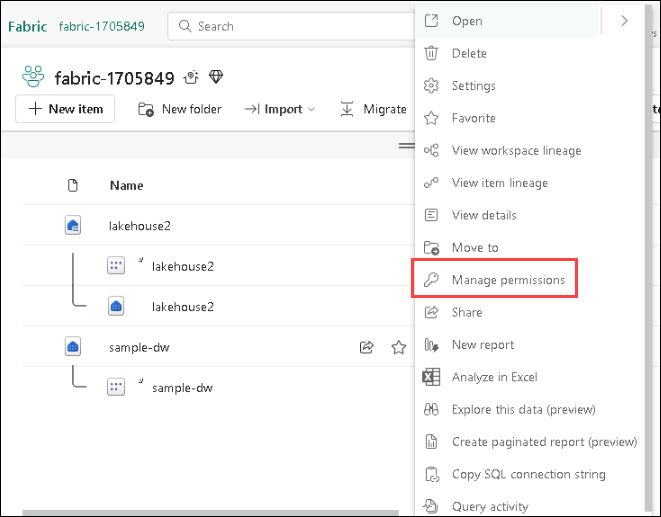

12. Select **Add user** and enter the email of the second user - <inject key="testuser" enableCopy="true"/>.
 
13. In the box that appears, under **Additional permissions** check **Read all data using SQL (ReadData)** and uncheck all other boxes.

    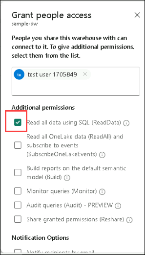

15. Select **Grant**

16. Return to the browser window where you're logged in as the **second user**. Refresh the browser view.  

17. The second user no longer has access to the workspace and instead has access to only the warehouse. You can no longer browse workspaces on the left navigation pane to find the warehouse. Select **OneLake catalog** on the left navigation menu to find the warehouse. 

18. Select the warehouse. On the screen that appears, select **Open** from the top menu bar.

19. When the warehouse view appears, select the **Date** table to view table data. The rows are viewable because the user still has read access to the warehouse because ReadData permissions were applied by using item permissions on the warehouse.

### Task 5: Apply OneLake data access roles in a Lakehouse

OneLake data access roles let you create custom roles within a Lakehouse and grant read permissions to folders you specify. OneLake data access roles is currently a Preview feature.

In this task, you assign an item permission and create a OneLake data access role and experiment with how they work together to restrict access to data in a Lakehouse.  

1. Stay in the browser where you're logged in as the second user - <inject key="testuser" enableCopy="true"/>.

1. Select **OneLake** on the left navigation bar. The second user doesn't see the lakehouse.
   
1. Return to the browser where you're logged in as the **Workspace Admin**.
   
1. Select **Workspaces** on the left menu and select your workspace. Hover over the name of the lakehouse.
   
1. Select on the ellipse (**...**) to the right of the ellipse and select **Manage permissions**

   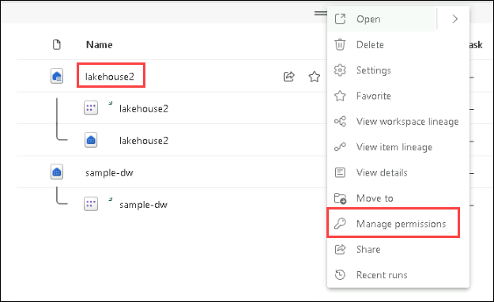
   
1. On the screen that appears, select **Add user**.
    
1. Assign the second user - <inject key="testuser" enableCopy="true"/> to the lakehouse and ensure none of the checkboxes on the **Grant People Access** window are checked.
    
1. Select **Grant**. The second user now has read permissions on the lakehouse. Read permission only allows the user to see metadata for the lakehouse but not the underlying data. Next we'll validate this.
    
1. Return to the browser where you're logged in as the second user. Refresh the browser.
    
1. Select **OneLake** in the left navigation pane.
    
1. Select the **lakehouse** and open it.
    
1. Select **Open** on the top menu bar. You're unable to expand the tables or files even though read permission was granted. Next, you grant the second user access to a specific folder using OneLake data access permissions.
    
1. Return to the browser where you're logged in as the workspace administrator.
    
1. Select **Workspaces** from the left navigation bar.
    
1. Select your workspace name.
    
1. Select the **lakehouse**.
    
1. When the lakehouse opens, select **Manage OneLake data access (preview)** on the top menu bar and enable the feature by clicking the **Continue** button.
    
1. Select **+ New** on the **OneLake security** screen that appears.

    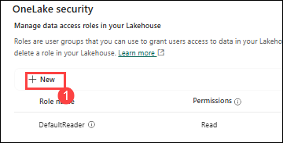

1. Enter **publicholidays (1)** for the Role name and click on **Selected data (2)** under **Add data to your role** section.

    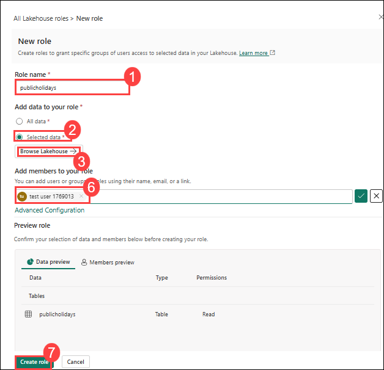

1. Select **Browse Lakehouse (3)** and select **publicholidays (4)** table and click on **Add data (5)**

    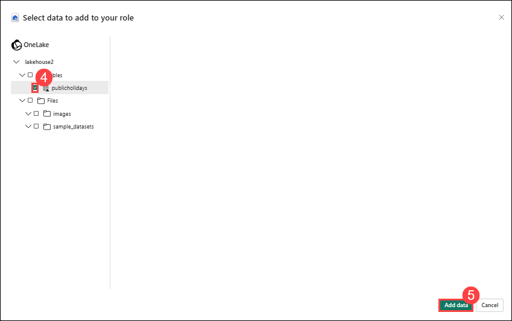

1. Add the second user - <inject key="testuser" enableCopy="true"/> (6)in the **Add members to your role** section.

1. Click on **Create role (7)**
        
1. Return to the browser where you're logged in as the second user. Ensure you're still on the page where the lakehouse is open. Refresh the browser.
    
1. Select the **publicholidays** table and wait for the data to load. Only the data in the publicholidays table is accessible to the user because the user was assigned to the custom OneLake data access role. The role permits them to see only the data in the publicholidays table, not data in any of the other tables, files, or folders.

## Review

In this lab, you learned how to:

- Create and manage a lakehouse in Microsoft Fabric.

- Ingest data into a lakehouse using a Dataflow Gen2.

- Query lakehouse data using a Spark notebook.

- Monitor and track activity execution history through the monitoring hub.

- Apply filters and customize columns to optimize the monitoring experience.

## Now, click on Next from the lower right corner to move on to the next lab.
