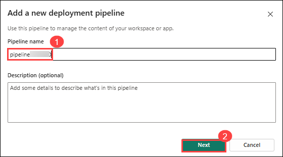
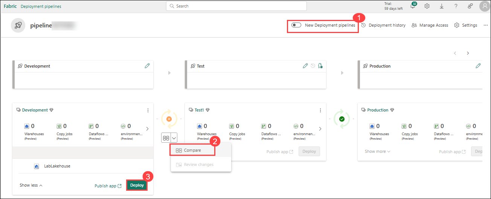

# Lab 3: Implement deployment pipelines in Microsoft Fabric

## Estimated Duration : 45 minutes

Deployment pipelines in Microsoft Fabric let you automate the process of copying   changes made to the content in Fabric items between environments like development, test, and production. You can use deployment pipelines to develop and test content before it reaches end users. In this exercise, you create a deployment pipeline, and assign stages to the pipeline. Then you create some content in a development workspace and use deployment pipelines to deploy it between the Development, Test and Production pipeline stages.

In this hands-on lab, you will implement deployment pipelines in Microsoft Fabric to automate the promotion of content across different environments such as Development, Test, and Production. You will create workspaces, configure a deployment pipeline, generate content in the Development workspace, and use deployment pipelines to deploy the content across stages. This exercise demonstrates how to streamline content management and validation before it reaches end users.

## Lab Objectives

In this lab, you will complete the following tasks:

- Task 1: Create a data warehouse

- Task 2: Create a lakehouse

- Task 3: Apply workspace access controls

- Task 4: Apply item access control

- Task 5: Apply OneLake data access roles in a Lakehouse

### Task 1: Create workspaces

In this task, you will create three workspaces in Microsoft Fabric — Development, Test, and Production — with Fabric capacity enabled.

1. In the menu bar on the left, select **Workspaces** (the icon looks similar to &#128455;).
1. Create a new workspace named Development, selecting a licensing mode that includes Fabric capacity (*Trial*, *Premium*, or *Fabric*).
1. Repeat steps 1 & 2, creating two more workspaces named Test, and Production. Your workspaces are: Development, Test, and Production.
1. Select the **Workspaces** icon on the menu bar on the left and confirm that there are three workspaces named:  Development, Test, and Production

   > **Note**: If you are prompted to enter a unique name for the workspaces, append one or more random numbers to the words: Development, Test, or Production.

### Task 2: Create a deployment pipeline

In this task, you will create a new deployment pipeline that will manage the movement of content across the Development, Test, and Production stages.

1. In the menu bar on the left, select **Workspaces**.
2. Select **Deployment Pipelines**, then **New pipeline**.
3. In the **Add a new deployment pipeline** window, enter **pipeline<inject key="DeploymentID" enableCopy="false"/> (1)** as the pipeline name, then click **Next (2)** to continue.

   
4. Accept the defaults on the **Customize your stages** window.  

   

5. Select **Create and Continue**.

### Task 3: Assign workspaces to stages of a deployment pipeline

In this task, you will assign the previously created workspaces to their respective stages in the deployment pipeline.

1. On the left menu bar, select the pipeline you created. 
2. In the window that appears, select on the word **Select** under each deployment stage and select the name of the workspace that matches the name of the stage.
3. Select **Assign a workspace** for each deployment stage.

  

### Task 4: Create content

In this task, you will create a lakehouse named LabLakehouse in the Development workspace and populate it with sample data.

1. In the menu bar on the left, select **Workspaces**.
2. Select the **Development** workspace.
3. Select **New Item**
4. In the window that appears, select **Lakehouse** and in the **New lakehouse window**, name the lakehouse, **LabLakehouse**.
5. Select **Create**.
6. Select the **Start with sample data** tile, then on the **Use a Sample** page, choose the **Public holidays** tile to populate the workspace with sample data.

    

7. In the menu bar on the left, select the pipeline you created, then **toggle off (1)** New Deployment Pipelines to disable the feature.
8. In the **Development** stage, select the **>** until you see **Lakehouses**. The lakehouse shows up as new content in the Development stage. Between the **Development** and **Test** stages, there's an orange **X** within a circle. The orange **X** indicates that the Development and Test stages aren't synchronized.
9. Select the downward arrow below the orange **X** to compare the content in the Development and Test environments. Select **Compare (1)**.The LabLakehouse only exists in the Development stage.  

  

### Task 5: Deploy content between stages

In this task, you will use the deployment pipeline to move the lakehouse content from Development to Test, and then to Production, verifying the synchronization at each stage.

Deploy the lakehouse from the **Development** stage to the **Test** and **Production** stages.
1. Select the **Deploy (2)** button in the **Development** stage of the pipeline to copy the lakehouse in its current state to the text stage. 
2. In the **Deploy to next stage** window, select **Deploy**.
3. There is an orange X between the Test and Production stages. Select the downward facing arrow below the orange X. The lakehouse exists in the Development and Test stages but not yet in the Production stage.
4. In the **Test** stage, select **Deploy**.
5. In the **Deploy to next stage** window, select **Deploy**. The green check mark between the stages indicates that all stages in sync and contain the same content.
6. Using deployment pipelines to deploy between stages also updates the content in the workspaces corresponding to the deployment stage. Let's confirm.
7. In the menu bar on the left, select **Workspaces**.
8. Select the **Test** workspace. The lakehouse was copied there.
9. Open the **Production** workspace from the **Workspaces** icon on the left menu. The lakehouse was copied to the Production workspace too.

## Review

In this lab, you learned how to:

- Create and manage a data warehouse in Microsoft Fabric.

- Create and manage a lakehouse in Microsoft Fabric.

- Apply workspace access controls to manage user permissions.

- Apply item-level access controls for finer security management.

- Apply OneLake data access roles to secure data within a lakehouse.

## You have successfully completed the lab
