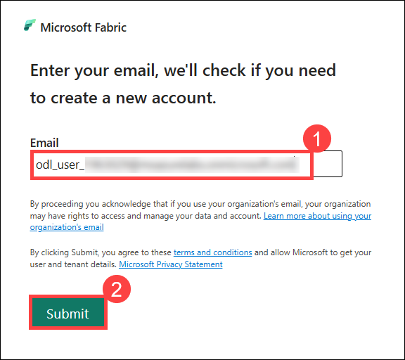
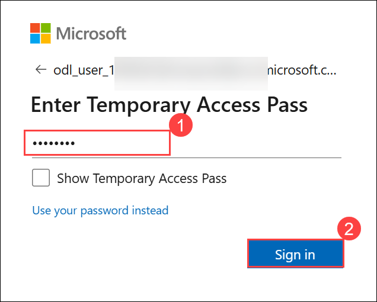
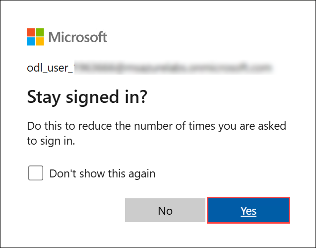
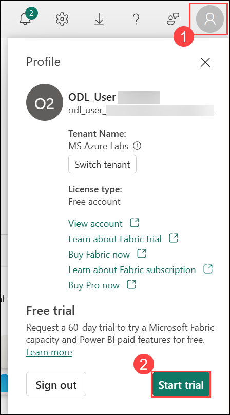
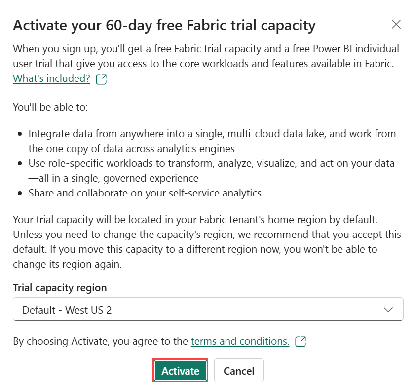
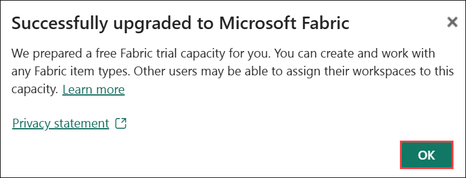
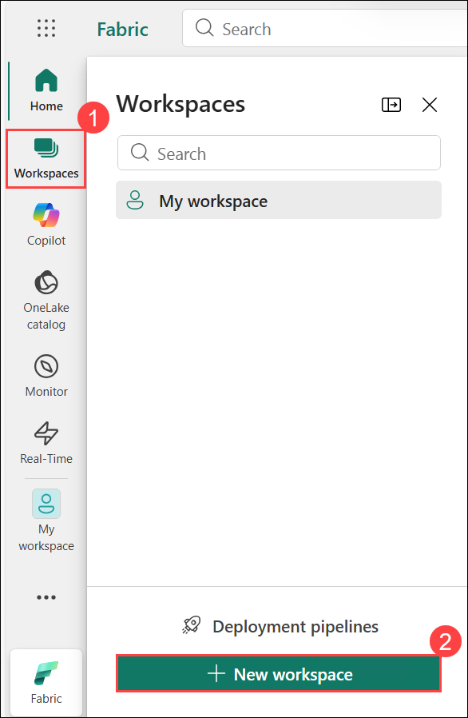
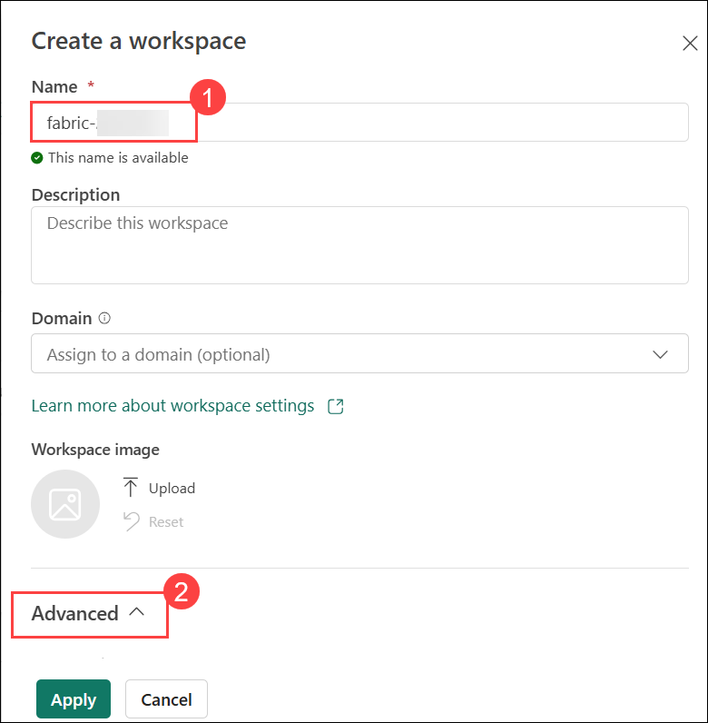

# Lab: Prerequisite: Create a Fabric workspace

### Estimated Duration: 15 Minutes

In this exercise, you will sign up for the Microsoft Fabric Trial and create a workspace, establishing the foundation for working within the Microsoft Fabric platform. This initial setup enables you to explore and utilize a wide range of integrated tools and services for data integration, analytics, and visualization. Creating a workspace provides a dedicated environment to organize and manage resources effectively, while also supporting collaboration across teams and projects. This foundational step is essential for understanding how to navigate and operate within Microsoft Fabric.

## Lab Objectives

In this lab, you will be able to complete the following tasks:

- Task 1: Sign up for the Microsoft Fabric Trial
- Task 2: Create a workspace

## Task 1: Sign up for Microsoft Fabric Trial

In this task, you will initiate your 60-day free trial of Microsoft Fabric by signing up through the Fabric app, providing access to its comprehensive suite of data integration, analytics, and visualization tools.

1. Open the **Microsoft Edge** browser in the LabVM, navigate to the following URL  

   ```
   https://app.fabric.microsoft.com/home?experience=fabric-developer
   ```

1. Enter below Email and click on **Submit (2)**:
 
   - Email/Username: **<inject key="AzureAdUserEmail"></inject> (1)**
 
     

1. Next, provide the password below and click on **Sign in (2)**
 
   - Password: **<inject key="AzureAdUserPassword"></inject> (1)**
 
      

1. On **Stay signed in?** pop-up window appears, click on **Yes**.

   

### Activate the Microsoft Fabric Free Trial  

1. In the Fabric portal, click on **Account Manager (1)** and then select **Free trial (2)**.

     

2. In the prompt that appears, click **Activate** to start your **60-day free Fabric trial**.  

     

3. Once the trial is successfully activated, click **OK** on the **Successfully upgraded to Microsoft Fabric** dialog.  

     

   >**Note:** If the **Invite teammates to try Fabric to extend your trial** window opens, please **close it**. 

## Task 2: Create a workspace

In this task, you will create a Fabric workspace. The workspace contains all the items needed for this tutorial, which includes lakehouse, dataflows, Data Factory pipelines, notebooks, Power BI datasets, and reports.

1. From the left menu bar, select **Workspaces (1)** and click on **+ New workspace (2)**.

   

1. On **Create a workspace** window, enter the below name and expand the **Advanced (2)** setttings:

   - **Name:** Enter **fabric-<inject key="DeploymentID" enableCopy="false"/>** (1)

     

1. Under **License mode**, select the **Fabric Trial (1)** and click on **Apply (2)**.

   

   >**Note:** If the **On the Introducing task flows** window opens, select **Got it**.

## Summary

In this exercise, you have signed up for the Microsoft Fabric Trial and created a workspace.

## Review 
In this lab, you have completed:

 + Signed up for Microsoft Fabric Trial
 + Created a workspace

### You have successfully completed the lab. Click on Next >> to proceed with next Lab.

