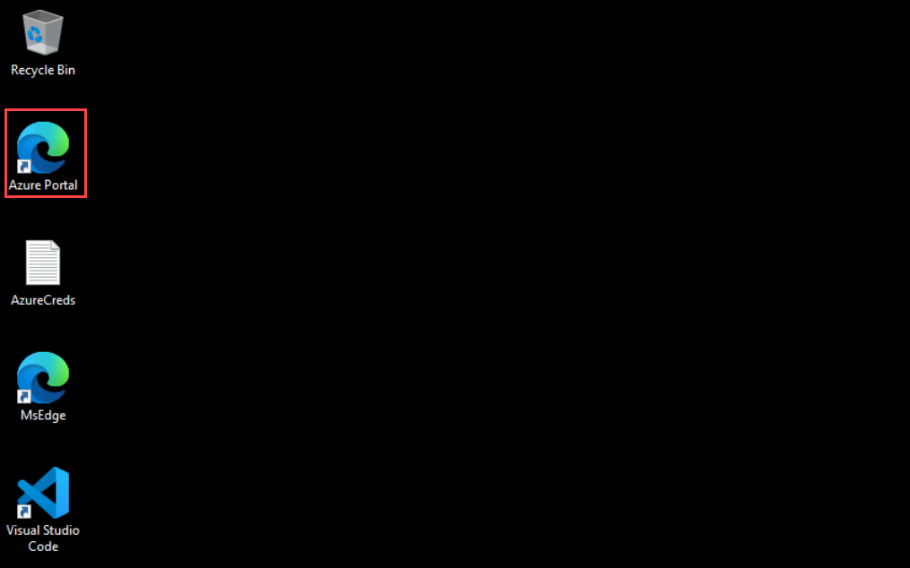
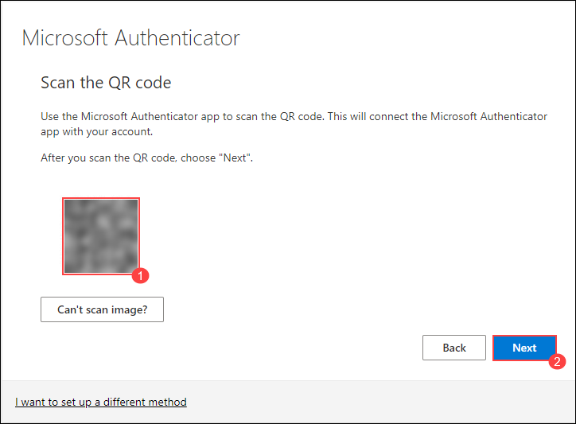

# DP-700: Microsoft-Fabric-Data-Engineer Workshop

Welcome to your DP-700: Microsoft-Fabric-Data-Engineer Workshop! We've prepared a seamless environment for you to explore and learn Azure Services. Let's begin by making the most of this experience.

### Overall Estimated timing: 4 hrs

In this hands-on lab, you'll gain practical experience working with Microsoft Fabric to analyze, process, and visualize data across various services. You will learn how to create a Fabric workspace, ingest and transform data using pipelines and Dataflows Gen2, and analyze it with Apache Spark. You'll also explore real-time data processing by creating Eventstreams and interacting with eventhouse for real-time insights. By the end of this lab, you'll be equipped with the skills to build end-to-end data workflows and real-time analytics solutions in Microsoft Fabric.

## Objectives

By the end of this lab, you will be able to create a Microsoft Fabric workspace, ingest and transform data using pipelines and Dataflows Gen2, analyze data with Apache Spark, and implement real-time analytics using Eventstreams and eventhouse.

1. **Analyze data with Apache Spark in Fabric**: **Analyze data with Apache Spark in Fabric**: You will learn how to use Apache Spark within Microsoft Fabric to explore and analyze large datasets. This task will guide you through creating Spark notebooks, running distributed data processing tasks, and performing data transformations to gain meaningful insights.

1. **Ingest data with a pipeline in Microsoft Fabric**: You will learn how to build data pipelines to ingest data from external sources into a lakehouse in Microsoft Fabric. This includes using Apache Spark to apply custom transformations before loading the data for analysis.

1. **Create and use Dataflows (Gen2) in Microsoft Fabric**: You will learn how to create and configure Dataflows (Gen2) to connect to data sources and perform transformations using Power Query Online. This task introduces the core features of Dataflows and demonstrates how they can be used in pipelines or Power BI datasets.

1. **Get started with Real-Time Intelligence in Microsoft Fabric**: You will learn how to use Real-Time Intelligence features in Microsoft Fabric to ingest, analyze, and visualize streaming data. This task focuses on building a real-time analytics solution using a live stream of stock market data.

1. **Ingest real-time data with Eventstream in Microsoft Fabric**: You will learn how to use Eventstream in Microsoft Fabric to capture, transform, and route real-time event data. This task involves ingesting live data from a bike-share system and configuring the stream to send processed events to various destinations.

1. **Work with data in a Microsoft Fabric eventhouse**: You will learn how to create and use an eventhouse in Microsoft Fabric to store and query real-time event data. This task involves populating the eventhouse with sample taxi ride data and using KQL and SQL to analyze the information.

## Pre-requisites

- Basic familiarity with Apache Spark and notebooks (e.g., using PySpark)
- Understanding of ETL/ELT processes and data transformation concepts
- Familiarity with real-time data concepts and streaming sources
- Basic knowledge of configuring Eventstreams with inputs, transformations, and outputs
- Understanding of Kusto Query Language (KQL) and basic SQL for querying event data

## Architecture

In this hands-on lab, the architecture flow includes several essential components.

1. **Analyze data with Apache Spark in Fabric**: Learning how to use Apache Spark within Microsoft Fabric to explore and analyze large-scale datasets. This includes creating notebooks, executing distributed data operations, and performing transformations to uncover insights.

1. **Ingest data with a pipeline in Microsoft Fabric**: Building and configuring data pipelines to ingest data from external sources into a Fabric lakehouse. This process includes applying transformations using Apache Spark and automating data loading for analysis.

1. **Create and use Dataflows (Gen2) in Microsoft Fabric**: Understanding how to use Power Query Online to build Dataflows (Gen2), which connect to data sources, perform transformations, and feed downstream components like pipelines or Power BI reports.pipelines or Power BI datasets.

1. **Get started with Real-Time Intelligence in Microsoft Fabric**: Setting up a real-time analytics solution using Fabric’s Real-Time Intelligence capabilities. This involves ingesting and visualizing live data streams, such as stock market feeds, for instant insights.

1. **Ingest real-time data with Eventstream in Microsoft Fabric**: Capturing and transforming real-time event data using Eventstream. You’ll configure event sources, apply stream transformations, and route output to destinations like a lakehouse or eventhouse.

1. **Work with data in a Microsoft Fabric eventhouse**: Creating and querying an eventhouse, a storage solution optimized for real-time data. You'll load sample event data (e.g., taxi rides) and use Kusto Query Language (KQL) and SQL to perform analysis.

## Architecture Diagram

 

## Explanation of Components

1. **Apache Spark:** Apache Spark is the core, open-source, distributed computing engine powering data engineering and data science workloads, enabling users to analyze and process data at scale within a Lakehouse environment. 

1. **Pipeline:** A pipeline is a logical grouping of activities that orchestrate data ingestion and transformation tasks, allowing users to create and manage complex data workflows through a graphical user interface.

1. **Dataflows (Gen2)**: Its a new generation of dataflows that allow you to connect to various data sources, perform transformations using Power Query Online, and then load the transformed data into various destinations like Lakehouses, Warehouses, or Azure SQL Databases, offering a low-code, cloud-based data preparation experience. 

1. **Real-time Intelligence:** It is an end-to-end solution for event-driven scenarios, streaming data, and data logs.

1. **Eventstreams**: The eventstreams feature in Microsoft Fabric gives you a centralized place in the Fabric platform to capture, transform, and route real-time events to various destinations with a no-code experience.

1. **Eventhouse**: An eventhouse is a workspace of databases, which might be shared across a certain project.

# Getting Started with lab
 
Welcome to your AI-900: Microsoft Azure AI Fundamentals workshop! We've prepared a seamless environment for you to explore and learn about machine learning and AI concepts and related Microsoft Azure services. Let's begin by making the most of this experience:
 
## Accessing Your Lab Environment
 
Once you're ready to dive in, your virtual machine and **lab guide** will be right at your fingertips within your web browser.
 

### Virtual Machine & Lab Guide
 
Your virtual machine is your workhorse throughout the workshop. The lab guide is your roadmap to success.

## Exploring Your Lab Resources
 
To get a better understanding of your lab resources and credentials, navigate to the **Environment** tab.
 

## Lab Guide Zoom In/Zoom Out
 
To adjust the zoom level for the environment page, click the **A↕: 100%** icon located next to the timer in the lab environment.

## Utilizing the Split Window Feature
 
For convenience, you can open the lab guide in a separate window by selecting the **Split Window** button from the Top right corner.
 

## Managing Your Virtual Machine
 
Feel free to **start, stop, or restart (2)** your virtual machine as needed from the **Resources (1)** tab. Your experience is in your hands!
 

## Lab Duration Extension

1. To extend the duration of the lab, kindly click the **Hourglass** icon in the top right corner of the lab environment. 

    

    >**Note:** You will get the **Hourglass** icon when 10 minutes are remaining in the lab.

2. Click **OK** to extend your lab duration.
 
   

3. If you have not extended the duration prior to when the lab is about to end, a pop-up will appear, giving you the option to extend. Click **OK** to proceed.

## Let's Get Started with Azure Portal
 
1. On your virtual machine, click on the Azure Portal icon as shown below:
 
   

1. You'll see the **Sign into Microsoft Azure** tab. Here, enter your credentials:
 
   - **Email/Username:** <inject key="AzureAdUserEmail"></inject>
 
       
 
1. Next, provide your password:
 
   - **Password:** <inject key="AzureAdUserPassword"></inject>
 
     
 
1. If prompted to stay signed in, you can click **No**.

1. If **Action required** pop-up window appears, click on **Ask later**.
   
    
 
1. If a **Welcome to Microsoft Azure** pop-up window appears, simply click **Cancel**.

## Steps to Proceed with MFA Setup if the "Ask Later" Option is Not Visible

1. If you see the pop-up **Stay Signed in?**, click **No**.

1. If **Action required** pop-up window appears, click on **Next**.
   
   

1. On **Start by getting the app** page, click on **Next**.
1. Click on **Next** twice.
1. In **android**, go to the play store and Search for **Microsoft Authenticator** and Tap on **Install**.

   

   > Note: For Ios, Open the app store and repeat the steps.

   > Note: Skip if already installed.

1. Open the app and tap on **Scan a QR code**.

1. Scan the QR code visible on the screen **(1)** and click on **Next (2)**.

   

1. Enter the digit displayed on the Screen in the Authenticator app on mobile and tap on **Yes**.

1. Once the notification is approved, click on **Next**.

   

1. Click on **Done**.

1. If prompted to stay signed in, you can click **"No"**.

1. Tap on **Finish** in the Mobile Device.

   > NOTE: While logging in again, enter the digits displayed on the screen in the **Authenticator app** and click on Yes.

1. If a **Welcome to Microsoft Azure** pop-up window appears, simply click **"Cancel"** to skip the tour.

1. If you see the pop-up **You have free Azure Advisor recommendations!**, close the window to continue the lab.

## Support Contact
 
The CloudLabs support team is available 24/7, 365 days a year, via email and live chat to ensure seamless assistance at any time. We offer dedicated support channels explicitly tailored for both learners and instructors, ensuring that all your needs are promptly and efficiently addressed.
 
Learner Support Contacts:
 
- Email Support: cloudlabs-support@spektrasystems.com
- Live Chat Support: https://cloudlabs.ai/labs-support

Click on **Next** from the lower right corner to move on to the next page.

   .png)

## Happy Learning !!
