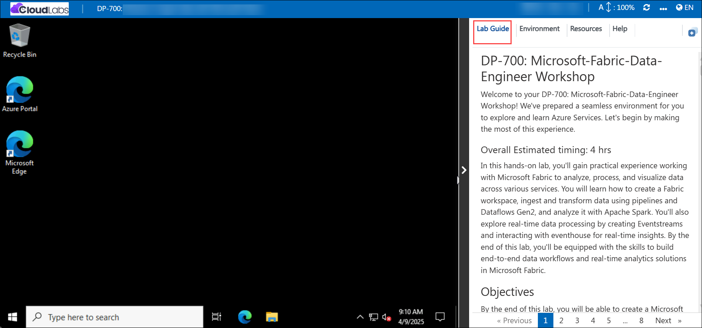
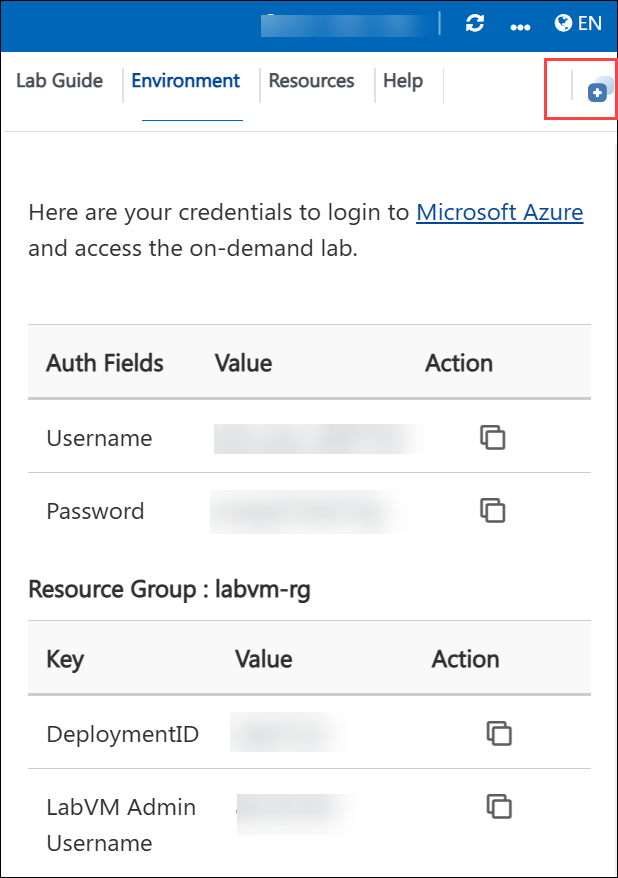

# DP-700: Microsoft-Fabric-Data-Engineer Workshop

Welcome to your DP-700: Microsoft-Fabric-Data-Engineer Workshop! We've prepared a seamless environment for you to explore and learn Azure Services. Let's begin by making the most of this experience.

### Overall Estimated timing: 90 minutes

In this hands-on lab, you will build an end-to-end real-time data streaming solution. You will start by creating an eventhouse and an eventstream to manage and process incoming data. You will then add a data source and configure a destination to route the processed data appropriately. After setting up the streaming infrastructure, you will create a real-time dashboard to visualize the data, including building a base query, adding parameters for dynamic insights, and customizing the dashboard with additional pages. Finally, you will configure auto-refresh settings to keep the data current and learn how to save and share the dashboard for collaboration.

## Objectives

By the end of this lab series, you will be able to create and manage a Microsoft Fabric eventhouse, configure eventstreams with real-time data sources and destinations, and build interactive real-time dashboards using base queries, parameters, and auto-refresh features to visualize and share live data insights effectively.

1. **Create an eventhouse**: You will learn how to create an eventhouse in Microsoft Fabric, which provides a centralized and scalable foundation for capturing and storing streaming data. This task will guide you through creating a workspace, setting up the eventhouse, and understanding how real-time event data is organized and persisted for downstream analytics.

1. **Create an eventstream**: You will learn how to add a data source to your eventstream in Microsoft Fabric to enable real-time data ingestion. This task will guide you through connecting an external system—such as an Event Hub, IoT Hub, or other streaming service—as a source, allowing your eventstream to begin capturing and processing live event data.

1. **Add a source**: You will learn how to add a destination to your eventstream in Microsoft Fabric, enabling it to route processed data to storage or analytics platforms such as a lakehouse or KQL database for real-time insights and further processing.

1. **Add a destination**: You will learn how to add a destination to your eventstream in Microsoft Fabric, enabling processed streaming data to be routed to storage or analytics tools such as a lakehouse or KQL database for further use.

1. **Create a real-time dashboard**: You will learn how to create a real-time dashboard in Microsoft Fabric to visualize and monitor live data from your eventstream, enabling instant insights and responsive decision-making.

1. **Create a base query**: You will learn how to create a base query in Microsoft Fabric to streamline your dashboard visuals by centralizing common data logic, improving efficiency and maintainability.

1. **Add a parameter**: You will learn how to add a parameter to your Microsoft Fabric dashboard, allowing you to filter and display data based on specific criteria, such as selecting a neighborhood to focus on for more targeted insights.

1. **Add a page**: You will learn how to add multiple pages to your Microsoft Fabric dashboard, enabling you to organize and display different sets of data across different views for a more comprehensive and interactive experience.

1. **Configure auto refresh**: You will learn how to configure auto-refresh for your Microsoft Fabric dashboard, enabling automatic data updates at specified intervals to keep your visualizations up-to-date with the latest information without requiring manual intervention.

1. **Save and share the dashboard**: You will learn how to save and share your Microsoft Fabric dashboard, enabling you to store your work and grant access to other users for collaborative analysis and decision-making based on real-time data insights.

## Pre-requisites

- Basic knowledge of Microsoft Fabric, including creating and managing workspaces and resources.
- Understanding of how to create and configure dashboards for data visualization.
- Familiarity with querying and data manipulation using base queries for real-time data processing.
- Basic knowledge of configuring automatic updates and refreshing visualizations in dashboards.

## Architecture

In this hands-on lab, the architecture flow includes several essential components.

1. **Create an Eventhouse in Microsoft Fabric**: Learning how to create an eventhouse in Microsoft Fabric to establish a centralized and scalable foundation for capturing and storing streaming data. This involves setting up a workspace, creating the eventhouse, and understanding how real-time events are persisted and organized for downstream analytics.

1. **Create an Eventstream in Microsoft Fabric**: Setting up an eventstream in Microsoft Fabric to enable real-time data ingestion from external systems. This includes connecting sources such as Azure Event Hub, IoT Hub, or other streaming services to start capturing and processing live event data.

1. **Add a Source to an Eventstream in Microsoft Fabric**: Learning how to integrate a streaming data source with your eventstream to begin ingesting real-time data from services like Event Hub or IoT Hub. This enables your eventstream to continuously capture event data for processing and analysis.

1. **Add a Destination to an Eventstream in Microsoft Fabric**: Understanding how to configure a destination for your eventstream to route processed streaming data to storage or analytics tools such as a lakehouse or KQL database, enabling real-time insights and integration with downstream systems.

1. **Create a Real-Time Dashboard in Microsoft Fabric**: Developing a real-time dashboard to visualize and monitor live data from an eventstream. This task helps in creating responsive dashboards for instant insights and better decision-making based on streaming data.

1. **Create a Base Query in Microsoft Fabric**: Learning how to design a base query for your dashboard to centralize common logic and streamline visualizations. This approach enhances efficiency, consistency, and maintainability of your data-driven reports.

1. **Add a Parameter to a Microsoft Fabric Dashboard**: Adding interactive parameters to your dashboard to allow filtering and customizing the displayed data. This enables users to explore specific segments, such as filtering by region or time range, for more focused insights.

1. **Add a Page to a Microsoft Fabric Dashboard**: Expanding your dashboard by adding multiple pages to organize and present different data views. This allows for better structure and improved navigation across diverse insights within a single dashboard experience.

1. **Configure Auto Refresh in Microsoft Fabric Dashboards**: Enabling auto-refresh in your dashboards to keep visualizations current with the latest data. This ensures that users are always viewing up-to-date information without manual updates.

1. **Save and Share a Microsoft Fabric Dashboard**: Learning how to save your dashboard and share it with stakeholders for collaborative analysis. This includes managing permissions and ensuring real-time insights are accessible to relevant users and teams.

## Architecture Diagram

 

## Explanation of Components

1. **Eventhouse**: A centralized storage layer in Microsoft Fabric designed to capture and persist real-time event data at scale for downstream analytics.

1. **Eventstream**: A data pipeline in Microsoft Fabric that ingests, processes, and routes streaming data from sources like Event Hub or IoT Hub.

1. **Real-Time Dashboard**: A dynamic visualization tool that displays live data from eventstreams, enabling instant monitoring and insights.

1. **Base Query**: A reusable query that centralizes logic for dashboard visuals, improving consistency and simplifying maintenance.

# Getting Started with lab
 
Welcome to your DP-700: Microsoft Fabric Data Engineer Workshop! We've prepared a seamless environment for you to explore and learn about data engineering concepts and related Microsoft Fabric services. Let's begin by making the most of this experience:
 
## Accessing Your Lab Environment
 
Once you're ready to dive in, your virtual machine and **lab guide** will be right at your fingertips within your web browser.
 

### Virtual Machine & Lab Guide
 
Your virtual machine is your workhorse throughout the workshop. The lab guide is your roadmap to success.

## Exploring Your Lab Resources
 
To get a better understanding of your lab resources and credentials, navigate to the **Environment** tab.
 

## Lab Guide Zoom In/Zoom Out
 
To adjust the zoom level for the environment page, click the **A↕: 100%** icon located next to the timer in the lab environment.

## Utilizing the Split Window Feature
 
For convenience, you can open the lab guide in a separate window by selecting the **Split Window** button from the Top right corner.
 

## Managing Your Virtual Machine
 
Feel free to **start, stop, or restart (2)** your virtual machine as needed from the **Resources (1)** tab. Your experience is in your hands!
 

## Support Contact
 
The CloudLabs support team is available 24/7, 365 days a year, via email and live chat to ensure seamless assistance at any time. We offer dedicated support channels explicitly tailored for both learners and instructors, ensuring that all your needs are promptly and efficiently addressed.
 
Learner Support Contacts:
 
- Email Support: cloudlabs-support@spektrasystems.com
- Live Chat Support: https://cloudlabs.ai/labs-support

Click on **Next** from the lower right corner to move on to the next page.

   

## Happy Learning !!
