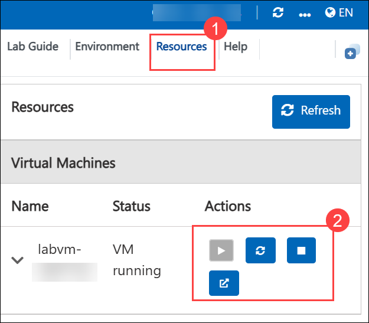

# DP-700: Microsoft-Fabric-Data-Engineer Workshop

Welcome to your DP-700: Microsoft-Fabric-Data-Engineer Workshop! We've prepared a seamless environment for you to explore and learn Azure Services. Let's begin by making the most of this experience.

### Overall Estimated timing: 2 hr 30 minutes

In this hands-on lab, you'll explore key administrative and operational features of Microsoft Fabric. You'll begin by monitoring activities across various Fabric artifacts—such as lakehouses, dataflows, and notebooks—using the centralized monitoring hub. Then, you'll learn how to secure data access at multiple levels using workspace permissions, item-level controls, and OneLake data access roles. Finally, you'll implement deployment pipelines to automate and manage content promotion across Development, Test, and Production environments. By the end, you'll gain practical experience in monitoring, securing, and operationalizing solutions in Microsoft Fabric.

## Objectives

By the end of this lab series, you will be able to monitor activity in Microsoft Fabric using the monitoring hub, secure data access with multi-layer permissions, and implement deployment pipelines to manage content across development, test, and production environments.

1. **Monitor Fabric activity in the monitoring hub**: You will learn how to monitor activities in Microsoft Fabric using the monitoring hub, track execution history of artifacts like lakehouses, dataflows, and notebooks, and customize views to manage large volumes of activity logs effectively.

1. **Secure data access in Microsoft Fabric**: You will learn how to secure data access in Microsoft Fabric by applying workspace access controls, item-level permissions, and OneLake data access roles. This lab will guide you through configuring security at multiple levels to protect sensitive data and control access within Data Warehouses and Lakehouses.

1. **Implement deployment pipelines in Microsoft Fabric**: You will learn how to implement deployment pipelines in Microsoft Fabric to automate the promotion of content across different environments like Development, Test, and Production. This lab will guide you through creating workspaces, configuring deployment pipelines, and managing content across stages for streamlined content validation and deployment.

## Pre-requisites

- Basic understanding of Microsoft Fabric architecture and core components like lakehouses, dataflows, and notebooks
- Familiarity with workspace and item-level access controls in cloud-based data platforms
- General knowledge of CI/CD concepts and deployment workflows

## Architecture

In this hands-on lab, the architecture flow includes several essential components.

1. **Create a Microsoft Fabric Lakehouse**: Learning how to create a lakehouse in Microsoft Fabric to unify the capabilities of a data lake and data warehouse. This includes setting up a centralized storage location for structured and unstructured data and preparing it for large-scale analytics and processing tasks.

1. **Use Delta Tables in Apache Spark**:
Exploring how to use Delta Tables within Microsoft Fabric to manage large datasets with ACID compliance and schema enforcement. This task involves creating Delta tables using Spark, querying them with SQL, and understanding how they support both batch and streaming data operations efficiently.

1. **Create a medallion architecture in a Microsoft Fabric lakehouse**:
Implementing the medallion architecture model (bronze, silver, and gold layers) to organize data workflows in a Fabric lakehouse. This includes using Spark notebooks to transform raw data through each layer, enhancing data quality, optimizing performance, and making it ready for analytics and reporting.

## Architecture Diagram

 

## Explanation of Components

1. **Fabric Lakehouse**: A Fabric Lakehouse is a data architecture in Microsoft Fabric that combines the features of a data lake and a data warehouse into a unified platform. It enables organizations to store, manage, and analyze structured, semi-structured, and unstructured data at scale using familiar tools and languages like SQL, Apache Spark, and Python.

1. **Apache Spark**: It is an open-source, distributed computing engine designed for fast and large-scale data processing. It’s widely used in big data environments for tasks such as data transformation, machine learning, and real-time analytics. 

1. **Medallion architecture**: It is a design pattern that organizes data into three layers (Bronze, Silver, and Gold) to improve data quality and structure as it progresses through each stage, facilitating optimized analytics. 

# Getting Started with lab
 
Welcome to your DP-700: Microsoft Fabric Data Engineer Workshop! We've prepared a seamless environment for you to explore and learn about data engineering concepts and related Microsoft Fabric services. Let's begin by making the most of this experience:
 
## Accessing Your Lab Environment
 
Once you're ready to dive in, your virtual machine and **lab guide** will be right at your fingertips within your web browser.
 

### Virtual Machine & Lab Guide
 
Your virtual machine is your workhorse throughout the workshop. The lab guide is your roadmap to success.

## Exploring Your Lab Resources
 
To get a better understanding of your lab resources and credentials, navigate to the **Environment** tab.
 

## Lab Guide Zoom In/Zoom Out
 
To adjust the zoom level for the environment page, click the **A↕: 100%** icon located next to the timer in the lab environment.

## Utilizing the Split Window Feature
 
For convenience, you can open the lab guide in a separate window by selecting the **Split Window** button from the Top right corner.
 

## Managing Your Virtual Machine
 
Feel free to **start, stop, or restart (2)** your virtual machine as needed from the **Resources (1)** tab. Your experience is in your hands!
 

## Support Contact
 
The CloudLabs support team is available 24/7, 365 days a year, via email and live chat to ensure seamless assistance at any time. We offer dedicated support channels explicitly tailored for both learners and instructors, ensuring that all your needs are promptly and efficiently addressed.
 
Learner Support Contacts:
 
- Email Support: cloudlabs-support@spektrasystems.com
- Live Chat Support: https://cloudlabs.ai/labs-support

Click on **Next** from the lower right corner to move on to the next page.

   

## Happy Learning !!
